# 🎓 LearnToLearn

> **Authoritative Pedagogical AI Skill & Engine for Engineering Masterclasses and Interactive Learning Portals**

[](LICENSE)
[](https://github.com/WingRider18/LearnToLearn)
[](SKILL.md)

---

## 🌟 Overview

**LearnToLearn** hosts the official [`interactive-masterclass-generator`](skills/interactive-masterclass-generator/SKILL.md) skill. It provides an end-to-end, repeatable engineering methodology to transform dense university lecture slides, handwritten blackboard notes, academic syllabi, and technical codebases into **authoritative, interactive lifelong learning portals** for **any technical or scientific subject** (e.g., Statistics, Linear Algebra, Machine Learning, Deep Learning, Distributed Systems, Operating Systems, Database Internals, Quantum Mechanics, Computational Biology, Cloud Architecture, etc.).

This repository serves as the single source of truth for the skill. As we refine the pedagogical guidelines, UI components, simulation mechanics, and curriculum architectures during real-world guide generation (such as the flagship **AMES Masterclass**), the skill is continuously updated, tested, and maintained here.

---

## 🏛️ The 6 Universal Architectural Pillars

Every interactive masterclass generated by this skill adheres to six core pillars:

```mermaid
flowchart TD
    P1["<b>Pillar 1: Multi-Source Ingestion & Academic Verification</b><br>• Ingest Professor Slides, Transcripts, Handwritten Notes & Code<br>• Resolve Typos, Missing Normalizations & Misunderstandings"] --> P2["<b>Pillar 2: Pedagogical Curriculum Deconstruction</b><br>• Decompose Subject into 5–7 Natural Evolution Stages<br>• Map Prerequisite Dependencies & Conceptual Bridges"]
    P2 --> P3["<b>Pillar 3: The 4-Layer Epistemic Stack & Progressive Disclosure</b><br>• Layer 1: Intuition & Everyday Mental Anchor (Scannable Cards)<br>• Layer 2: Formal Axiomatic/Mathematical Rigor & Variable Dictionary<br>• Layer 3: Production Pipeline & Real-World Gotchas<br>• Layer 4: Professor Viva Voce Defense & Edge-Case Probes<br>• Two-Tier Progressive Disclosure: In-Situ Badges + Accordions"]
    P3 --> P4["<b>Pillar 4: Dual-Theme Interactive Visual UI Architecture</b><br>• Dark Mode & Premium Editorial Light Mode (localStorage)<br>• In-Situ Glowing Badges opening 880px Slide-Over Drawers<br>• Instant Spotlight Search (Zero DOM Mutation)<br>• Authentic Mathematical SVG Diagrams & Canvas Sandboxes"]
    P4 --> P5["<b>Pillar 5: Self-Assessment & Viva Defense Simulator</b><br>• Professor Oral Defense Bank & Counter-Intuitive Edge Cases<br>• Fatal Exam Trap Warnings & Proof Countermeasures<br>• Interactive Multi-Choice Knowledge Evaluator"]
    P5 --> P6["<b>Pillar 6: Practical Exam & Lab Evaluation Suite</b><br>• Zero-Leakage Pipeline & Dual Metric Evaluation<br>• 100% Pre-Executed Jupyter Notebook Architecture<br>• Terminal Dark Execution Cards & Matplotlib Charts<br>• Publication-Quality ReportLab PDF (NumberedCanvas)<br>• Automated Submission Packager & Zero-Defect Audit"]
```



---

## 🧠 Core Pedagogical Laws

1. **The Analogy-First Pedagogical Law (Intuition Before Formulas):** Never introduce Greek equations, matrix ranks, or abstract notations in a vacuum. Every concept follows the 4-step sequence: Everyday Analogy $\to$ Plain-English Reasoning $\to$ Domain Problem Grounding $\to$ Formal Axiomatic Rigor.
2. **The Progressive Disclosure Law (Zero Cognitive Overload):** Eliminate text walls. Long derivations and deep historical backgrounds live in **Tier 1 Slide-Over Drawers** (via in-situ clickable glowing badges) or **Tier 2 Collapsible Accordions**.
3. **The Mandatory Parameter Dictionary Law:** Every single mathematical equation is immediately followed by a structured Parameter Dictionary (Symbol, Parameter Name, Mathematical Role, Permissible Domain, and Substantive Units/Meaning).
4. **The 7-Stage Holistic Concept Blueprint Standard:** Every subtopic systematically covers:
   - **Stage 1:** Executive Concept Blueprint ("What IS this?" 360° identity, failure dilemma, cardinal mechanics table)
   - **Stage 2:** Everyday Dilemma & Physical Analogy ("Why do we need it?")
   - **Stage 3:** Core Conceptual Mechanism ("How does it think?")
   - **Stage 4:** Formal Mathematical Formulation & Parameter Dictionary
   - **Stage 5:** Visual Geometry / Constraint Surfaces
   - **Stage 6:** Concrete Numerical Walkthrough & Complete Arithmetic Expansion
   - **Stage 7:** Fatal Exam Traps, Edge Cases & Viva Defense
5. **The Slide-Parity & Provenance Mandate:** 100% syllabus coverage with visible metadata provenance bars linking every topic directly to corresponding lecture slide numbers and lab files. Zero hallucinated slide numbers.

---

## 📁 Repository Structure

```
LearnToLearn/
├── SKILL.md                               # Root skill specification
├── README.md                              # Project documentation & guidelines
├── LICENSE                                # MIT License
├── .gitignore                             # Ignored files
├── skills/
│   └── interactive-masterclass-generator/
│       └── SKILL.md                       # Canonical skill folder for agent discovery
├── scripts/
│   └── sync_and_push.sh                   # Auto-sync between local active skill & repo
└── docs/
    └── ARCHITECTURE.md                    # Deep-dive architectural breakdown
```

---

## 🚀 Installation & Usage

### Option 1: Global Installation (Recommended for Antigravity / Gemini CLI)

To make the skill globally available across all your workspaces:

```bash
mkdir -p ~/.gemini/config/skills/interactive-masterclass-generator
cp skills/interactive-masterclass-generator/SKILL.md ~/.gemini/config/skills/interactive-masterclass-generator/SKILL.md
```

### Option 2: Workspace-Level Installation

To install this skill specifically in an active workspace:

```bash
cd /path/to/your/workspace
mkdir -p .agents/skills/interactive-masterclass-generator
cp /path/to/LearnToLearn/SKILL.md .agents/skills/interactive-masterclass-generator/SKILL.md
```

### Option 3: Invoking the Skill

In your AI coding assistant prompt (Antigravity, Claude Code, Cursor, etc.):
```
Using the /interactive-masterclass-generator skill, review the lecture slides in <folder> 
and create an authoritative interactive masterclass guide following the 6 pillars.
```

---

## 🔄 Maintenance & Continuous Improvement Protocol

Whenever we improve, enrich, or add new pedagogical patterns while developing interactive guides:

1. **Local Skill Updates**: Edits made to `~/.gemini/config/skills/interactive-masterclass-generator/SKILL.md` are automatically detected.
2. **One-Command Sync & Push**: Run the maintenance script:
   ```bash
   ./scripts/sync_and_push.sh "feat: add unified marginal confusion matrix and numerical walkthrough standard"
   ```
   This script:
   - Verifies changes against the global and local skill copies
   - Synchronizes `SKILL.md` and `skills/interactive-masterclass-generator/SKILL.md`
   - Formats a semantic git commit
   - Pushes directly to `https://github.com/WingRider18/LearnToLearn`

---

## 📄 License

This project is licensed under the MIT License - see the [LICENSE](LICENSE) file for details.
