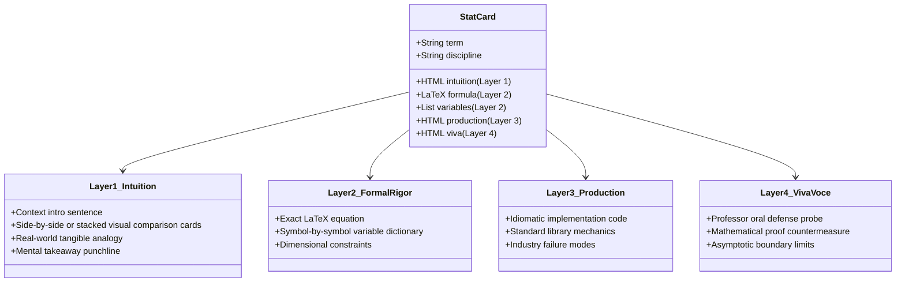
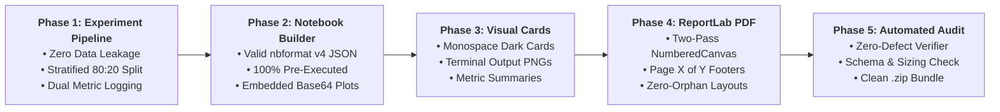

# 🎓 Interactive Masterclass Generator & Subject Mastery Engine

**Official Repository:** [https://github.com/WingRider18/LearnToLearn](https://github.com/WingRider18/LearnToLearn)

This skill provides an end-to-end, repeatable engineering methodology to transform complex academic curricula, lecture notes, textbook chapters, and technical specifications into an **authoritative, interactive lifelong learning portal** for **ANY subject** (e.g., Machine Learning, Deep Learning, Statistics, Econometrics, Distributed Systems, Operating Systems, Database Internals, Quantum Mechanics, Computational Biology, Cloud Architecture, Financial Engineering, etc.).

---

## 🏛️ The 6 Universal Architectural Pillars

Every subject mastery portal generated by this skill is built upon six foundational pillars:

```mermaid
flowchart TD
    P1["<b>Pillar 1: Multi-Source Ingestion & Academic Verification</b><br>• Ingest Professor Slides, Transcripts, Notes & Code<br>• Resolve Typos, Missing Normalizations & Misunderstandings"] --> P2["<b>Pillar 2: Pedagogical Curriculum Deconstruction</b><br>• Decompose Subject into 5–7 Natural Evolution Stages<br>• Map Prerequisite Dependencies & Conceptual Bridges"]
    P2 --> P3["<b>Pillar 3: The 4-Layer Epistemic Stack & Progressive Disclosure</b><br>• Layer 1: Intuition & Everyday Mental Anchor (Scannable Cards)<br>• Layer 2: Formal Axiomatic/Mathematical Rigor & Variable Dictionary<br>• Layer 3: Production Pipeline & Real-World Gotchas<br>• Layer 4: Professor Viva Voce Defense & Edge-Case Probes<br>• Two-Tier Progressive Disclosure: In-Situ Badges + Accordions"]
    P3 --> P4["<b>Pillar 4: Dual-Theme Interactive Visual UI Architecture</b><br>• Dark Mode & Premium Editorial Light Mode (localStorage)<br>• In-Situ Glowing Badges opening 880px Slide-Over Drawers<br>• Instant Spotlight Search (Zero DOM Mutation)<br>• Authentic Mathematical SVG Diagrams & Canvas Sandboxes"]
    P4 --> P5["<b>Pillar 5: Self-Assessment & Viva Defense Simulator</b><br>• Professor Oral Defense Bank & Counter-Intuitive Edge Cases<br>• Fatal Exam Trap Warnings & Proof Countermeasures<br>• Interactive Multi-Choice Knowledge Evaluator"]
    P5 --> P6["<b>Pillar 6: Practical Exam & Lab Evaluation Suite</b><br>• Zero-Leakage Pipeline & Dual Metric Evaluation<br>• 100% Pre-Executed Jupyter Notebook Architecture<br>• Terminal Dark Execution Cards & Matplotlib Charts<br>• Publication-Quality ReportLab PDF (NumberedCanvas)<br>• Automated Submission Packager & Zero-Defect Audit"]
```



---

## 🧠 Wise & Disciplined LLM Usage (The Anti-Hallucination & Anti-Overload Laws)

When generating or updating learning materials, the LLM must be directed with strict epistemological discipline:

### 1. Grounding & Zero-Trust Academic Verification
* **Never Hallucinate or Invent Formulas:** Always cross-reference equations and definitions against canonical peer-reviewed textbooks and standards (e.g., Hastie-Tibshirani-Friedman for Stats/ML, Cormen-Leiserson-Rivest-Stein for Algorithms, Hennessy-Patterson for Computer Architecture, Silberschatz for Operating Systems).
* **Active Transcript & Slide Error Correction:** Lecture slides and student handwritten notes frequently contain transcription typos (e.g., inverted signs, swapped indices, unnormalized fractions, missing degrees of freedom, mislabeled chart axes). The LLM must identify and resolve these discrepancies before writing them into code.
* **Dimensional Consistency Audit:** Every mathematical term must be verified for dimensional and units consistency (e.g., checking that variance has units squared, matrices match inner dimensions for multiplication, and probability simplexes sum to $1.0$).

### 2. The Progressive Disclosure Law (Zero Cognitive Overload)
* **Never Dump Monolithic Text Walls:** Long historical narratives, tangential derivations, or multi-paragraph analogies must never clutter the primary reading path. Doing so induces cognitive fatigue and obscures the core engineering takeaways.
* **Two-Tier Knowledge Access:**
  1. **Tier 1 (In-Situ Glowing Badges $\to$ Slide-Over Knowledge Drawer):**
     * Whenever a specialized technical, statistical, or mathematical concept appears in the text, wrap it in an interactive badge:
       ```html
       <span class="stat-badge" onclick="openStatCard('concept_key')">Concept Name ℹ️</span>
       ```
     * Clicking slides open the dedicated **880px Slide-Over Drawer** displaying the complete 4-layer breakdown without navigating away or losing context.
  2. **Tier 2 (Collapsible Deep-Dive Accordion Cards):**
     * Embed sleek `<details>` blocks for contextual derivations, historical etymology (e.g., Galton's 1886 *regredi*, medical ER triage history), and specialized matrices right where they are relevant:
       ```html
       <details class="deep-dive-card" style="background:var(--bg-card); border:1px solid var(--border-subtle); border-radius:var(--radius-md); padding:14px 18px; margin:16px 0;">
         <summary style="cursor:pointer; font-weight:700; color:var(--accent-cyan); font-size:0.9rem;">
           🔍 Intuitive Deep-Dive / Analogy / Comparison Table (Click to expand)
         </summary>
         <div style="margin-top:12px; line-height:1.6; font-size:0.88rem; color:var(--text-secondary);">...</div>
       </details>
       ```

### 3. The Analogy-First Pedagogical Law (Intuition Before Formulas)
* **Never Open with Raw Mathematical Formalisms:** Abstract set notation ($\vec{x} \in \mathbb{R}^p$), matrix ranks, and Greek derivations must NEVER be introduced in a vacuum without an intuitive anchor. Doing so induces cognitive overload and forces rote memorization.
* **The Mandatory 4-Step Epistemic Arc:** Every folded deep-dive, knowledge drawer, and new concept must follow this sequence:
  1. **Everyday Real-World Analogy:** Ground the concept in daily life (e.g., music streaming playlists for vector direction vs. magnitude, experienced home remodeling contractor for OLS regression, weather forecast city averages vs. porch thermometers for CI vs. PI, hospital emergency room triage for missing data).
  2. **Plain-English Conceptual Reasoning:** Explain "what does this number actually measure?" (e.g., coordinates as traits relative to normal, magnitude as overall activity volume, direction as qualitative ratio/vibe independent of scale).
  3. **Domain Problem Grounding:** Connect the analogy directly to the actual dataset and engineering task (e.g., car insurance underwriting, product SKU visibility, customer churn).
  4. **Formal Axiomatic / Mathematical Rigor:** Present the formal definitions, norms ($\|\mathbf{x}\|_2$), cosine angles, matrix inversions, and proofs, which are now immediately intuitive!
* **The Cinematic Continuity & "Connect-the-Dots" Mandate (Zero "Reference Manual Syndrome"):**
  - Technical documents frequently fail because they act as disjointed "piles of bricks"—presenting formulas, tables, and definitions without the causal mortar connecting them.
  - Every topic must establish an unbroken causal chain where each section directly answers a dilemma created by the previous one:
    1. **The Core Dilemma / Failure Hook:** Why does the naive baseline (e.g. 99% accuracy on rare fraud/attacks, unconstrained OLS, unpruned tree) catastrophically fail?
    2. **The 2-Word Mnemonic Decoder:** Always provide a permanent mental decoding rule before presenting grids or matrices (e.g. `[True/False (Match or Lie?)] + [Positive/Negative (Model's Guess, NEVER reality!)]`).
    3. **Metrics as Human Questions:** Every derived formula must be introduced as an answer to a plain-English human question (e.g., Precision = *"When the model cries wolf, how often is it right?"*; Recall = *"Out of all real wolves, how many did we catch?"*).
    4. **The Adversarial Tug-of-War:** Explain the dynamic tension between competing goals (e.g., Precision vs. Recall $\to$ Harmonic Mean $F_1$ as the strict referee; Aggressive vs. Conservative threshold dial $\to$ TPR vs. FPR).
    5. **The Grand Synthesis Climax ("Photograph $\to$ Coordinates $\to$ Movie $\to$ IMDb Rating"):**
       - Synthesize the whole chapter before sandboxes or exams:
         - **Confusion Matrix:** *The Photograph* (snapshot of performance at one fixed threshold $\theta = 0.5$).
         - **TPR & FPR:** *The Coordinates* extracted from that snapshot.
         - **ROC Curve:** *The Complete Time-Lapse Movie* stringing together 100 snapshots as threshold $\theta$ slides from $1.0 \to 0.0$.
         - **AUC:** *The Movie's Single IMDb Rating* grading overall discrimination between $0.5$ (coin flip) and $1.0$ (perfection).
         - **PR-AUC:** *The Fraud/Imbalance Lie Detector* that eliminates True-Negative inflation.
     6. **The Grand Unified Marginal Confusion Matrix Law (Spatial Row-vs-Column Architecture):**
        - Never render confusion matrices as disconnected static tables without marginal derivations.
        - Always construct the **Grand Unified Marginal Confusion Matrix**:
          - **Rows = Ground Truth ($Y$):** Reading horizontally gives the metrics conditioned on reality ($P(\hat{Y}|Y)$): **Sensitivity** ($\frac{TP}{TP+FN}$) and **Specificity** ($\frac{TN}{TN+FP}$). Because denominators are fixed by nature, they are completely invariant to class prevalence!
          - **Columns = Model Predictions ($\hat{Y}$):** Reading vertically gives the metrics conditioned on model calls ($P(Y|\hat{Y})$): **Precision** ($\frac{TP}{TP+FP}$) and **Negative Predictive Value** ($\frac{TN}{TN+FN}$). Because denominators are model calls, they are heavily prevalence-dependent via Bayes' Theorem!
          - **The Main Diagonal Trace:** $\text{Accuracy} = \frac{\text{tr}(M)}{\sum M_{ij}} = \frac{TP + TN}{TP + TN + FP + FN}$.
          - **The Off-Diagonal Errors:** Distinct error profiles clearly labeled: **Type I Error** ($\alpha$, False Alarm, bottom-left $FP$) vs. **Type II Error** ($\beta$, Fatal Miss, top-right $FN$).
          - **Interactive Hover & Touch Highlighting:** Implement kinetic hover states (`.hl-row-pos`, `.hl-row-neg`, `.hl-col-pos`, `.hl-col-neg`, `.hl-diag`) so students see rows, columns, and diagonals illuminate when inspecting each marginal metric.

### 4. The Single-Source-of-Study & Beginner-First Pedagogical Law (Zero Need for Secondary Slides or Google Search)
* **The Student Persona:** The learner is often encountering these technical concepts for the first time. They are NOT a professional statistician or pure mathematician. Never write like you are lecturing to peer researchers.
* **Zero Bare Formulas:** Every single mathematical equation must be preceded by an everyday dilemma, an analogy, and a plain-English explanation of what the symbols physically represent.
* **The Mandatory Parameter Dictionary Law (Zero Unannotated Symbols):**
  - Every single mathematical equation or system MUST be followed directly by an explicit, structured **Parameter Dictionary Table** containing:
    1. **Symbol:** The exact Greek or Latin character ($e_t, e_{t-1}, \rho, \hat{\rho}, v_t, h_{ii}, \lambda, \text{PSI}$).
    2. **Parameter Name:** The standard academic / industry terminology.
    3. **Mathematical Role:** What the parameter actually does in the formula (e.g. denominator penalty, lag-1 residual, projection operator).
    4. **Permissible Domain & Bounds:** The mathematical range (e.g. $d \in [0, 4]$, $\text{VIF} \ge 1.0$, $\lambda \ge 0$, $\rho \in [-1, 1]$).
    5. **Plain-English Substantive Meaning & Units:** What this variable represents in physical reality (e.g. Dollars, dimensionless ratio, squared errors).
* **The Concrete Toy Numbers Walkthrough Mandate:**
  - For any multi-step derivation, loss function, or diagnostic test (e.g. Durbin-Watson $d \approx 2(1 - \hat{\rho})$, Omitted Variable Bias, Breusch-Pagan auxiliary regression, ANOVA $F=t^2$, MAE vs. RMSE), the portal MUST provide a **concrete toy dataset walkthrough** (e.g. 3 or 4 simple numbers tracing the arithmetic step-by-step). Students must see the actual numbers move before encountering abstract summations.
* **The Universal Anti-Bare-Opening Law (Zero Bare Tables, Bare Equations, or Bare Code Openings):**
  - **STRICT PROHIBITION:** NEVER open ANY topic or subtopic abruptly with a bare data table, an ANOVA printout, a code snippet, or raw mathematical equations without first answering the foundational cognitive questions in an introductory blueprint box.
  - **Universal Scope:** This law applies to **100% of all subtopics without exception**—whether a high-level mathematical theorem (OLS BLUE derivation, Hat Matrix geometry, Bias-Variance Tradeoff) OR an operational, inferential, or data-engineering subtopic (Feature Scaling, Power Transformations, Train-Test Partitioning, Hypothesis Testing on Slopes, ANOVA Tables, Matrix Normal Equations, Hyperparameter Tuning). No subtopic is "too operational", "too practical", or "too minor" to omit its Executive Concept Blueprint.

* **The 7-Stage Holistic Concept Blueprint Standard for Every Subtopic:**
  Every technical concept and subtopic across all modules must follow this exact, non-fragmented cognitive hierarchy:
  1. **Stage 1: 🏛️ Executive Concept Blueprint ("What IS this?")**
     - **Plain-English 360° Identity:** What is this concept? Who formulated it? What does it represent in plain, non-intimidating language?
     - **Why Do We Need It / The Dilemma Solved:** What fatal flaw, breakdown, bias, or real-world disaster occurs if this technique or concept is absent?
     - **The Core Intuition & Everyday Mental Model:** A concrete, memorable physical analogy from daily life that grounds the concept before mathematical notation is introduced.
     - **The Cardinal Mechanics / Operating Rules Table:** A structured master table detailing 3–4 foundational properties summarizing what it does, what it does NOT do, its permissible domains, and its primary operational guarantees before any mathematical equations or parameter dictionaries appear.
     - **Canonical HTML Template (Zero Bare Opening Enforcer):**
       ```html
       <div class="subtopic-section">
         <div class="subtopic-section-title">🏛️ 1. Executive Concept Blueprint: [Concept Name]</div>
         <div style="background:var(--bg-card); border:1px solid var(--border-subtle); border-left:4px solid var(--accent-cyan); border-radius:var(--radius-md); padding:16px 20px; margin-bottom:16px; font-size:0.92rem; line-height:1.7;">
           <p style="margin-bottom:8px;"><strong>Plain-English 360° Identity:</strong> [What it is, who formulated it, what it represents in accessible terms]</p>
           <p style="margin-bottom:8px;"><strong>Why Do We Need It / The Dilemma Solved:</strong> [What failure mode/trap occurs if absent]</p>
           <p style="margin-bottom:0;"><strong>The Core Intuition:</strong> [Memorable physical analogy or mental model]</p>
         </div>
         <table class="parameter-table" style="margin-bottom:16px;">
           <thead>
             <tr>
               <th style="width:22%;">Foundational Property</th>
               <th style="width:38%;">Operational Reality &amp; Meaning</th>
               <th style="width:40%;">Primary Engineering Guarantee / Guardrail</th>
             </tr>
           </thead>
           <tbody>
             <tr>
               <td><strong>[Property 1]</strong></td>
               <td>...</td>
               <td>...</td>
             </tr>
             ...
           </tbody>
         </table>
       </div>
       ```
  2. **Stage 2: 🚨 The Everyday Dilemma & Physical Analogy ("Why do we need it?")**
     - The physical breakdown of naive approaches (e.g. why unconstrained OLS collapses on collinear data, why standardizing before Box-Cox causes NaNs, why fitting on test data corrupts production).
     - A tangible, relatable everyday analogy (e.g. telescope compression lens, courtroom jury signal-to-noise filter, external thermostat dial).
  3. **Stage 3: ⚙️ The Core Conceptual Mechanism ("How does it think?")**
     - The competing forces, dynamics, and trade-offs explained in plain English before symbols appear.
     - Control dials, knobs, and their asymptotic behavior at extreme limits ($0 \leftrightarrow \infty$).
  4. **Stage 4: 📐 Formal Mathematical Formulation & Parameter Dictionary**
     - Clean mathematical formulation without unexplained symbols.
     - Mandatory Parameter Dictionary Table (Symbol, Parameter Name, Mathematical Role, Permissible Domain, Substantive Meaning & Physical Units).
  5. **Stage 5: 📊 Visual Geometry / Constraint Surfaces**
     - Authentic SVG diagrams, vector projections, coordinate systems, or interactive canvas sandboxes.
  6. **Stage 6: 🔢 Concrete Numerical Walkthrough & Complete End-to-End Arithmetic Expansion**
     - **Zero Truncation Rule:** Step-by-step arithmetic from first principles. Substitute raw numbers into exact mathematical formulas (e.g. Euclidean distance, Kronecker delta, Bayes rule, Entropy/Gini, AdaBoost voting power $\alpha_t$ and weights $w_t(i)$, Log-Loss gradient steps $\boldsymbol{\theta}^{(1)} = \boldsymbol{\theta}^{(0)} - \alpha \nabla J$, XGBoost leaf weights $w^*$ and split gains).
     - **Explicit Intermediate Math:** Never truncate intermediate arithmetic with hand-waving or vague summaries. Calculate exact numerators, denominators, normalization constants ($Z$), intermediate exponentials, and exact percentages ($P(c \mid x)$).
     - **Formal $\arg\max$ & Sign Decision Rules:** Always conclude with the formal optimization operator (e.g. $\hat{y} = \arg\max_c P(c \mid x)$ or $H(x) = \text{sign}(\sum \alpha_t h_t(x))$) comparing all candidate scores with their normalized probabilities and highlighting the winning class.
     - **Unweighted vs Weighted Contrast:** Where applicable (e.g. KNN, Ensembles), evaluate unweighted majority voting side-by-side with distance/confidence-weighted voting to demonstrate how proximity or model certainty resolves ties and improves decision boundaries.
     - **1-to-1 Slide Parity:** Align numerical values and datasets with classroom lecture slides and official laboratory datasets.
  7. **Stage 7: ⚠️ Fatal Exam Traps, Edge Cases & Viva Defense**
     - Professor trick questions, oral defense probes, borderlines ($p=0.0632$ at $\alpha=0.05$ vs $0.10$), and implementation pitfalls.
* **The Regression vs. Classification Foundational Distinction Law:**
  - In technical domains where regression and classification coexist (e.g. Machine Learning, Econometrics, Diagnostic Modeling), the portal MUST clearly articulate the foundational mathematical and operational distinction right from the onset:
    1. **Target Space & Physical Nature:** Continuous metric quantities ($Y \in \mathbb{R}$, predicting price, temperature, demand) vs. Discrete categorical memberships ($Y \in \{0, 1\}$ or $\{1, \dots, K\}$, predicting diagnosis, churn, fraud).
    2. **Core Mathematical Estimand:** Conditional Expectation $\mathbb{E}[Y | X]$ (conditional mean surface) vs. Posterior Class Probabilities $P(Y = k | X)$ (partitioning boundaries).
    3. **Loss Function Mechanics:** Distance-penalizing squared error / absolute deviation ($L_2 = (y - \hat{y})^2$) vs. Information-theoretic divergence / Log-Loss ($-\sum y_k \log \hat{p}_k$).
    4. **Evaluation Metrics:** Continuous residual dispersion (RMSE, MAE, $R^2$, MAPE) vs. Categorical discrimination & calibration (Confusion Matrix, Precision, Recall, F1, ROC-AUC, Log-Loss).
* **The Unbroken Zero-to-Deployment Lifecycle Continuum:**
  - A masterclass portal must never read as an disconnected catalog of disjointed statistical tools. It must guide the learner through a coherent, natural progression mirroring the full real-world pipeline:
    $$\text{Data Ingestion \& Triage (M1)} \to \text{Mechanics \& Geometry (M0, M2)} \to \text{Diagnostic Stress-Testing (M3)} \to \text{Transformation (M4)} \to \text{Regularized Training (M5)} \to \text{Production Serving \& Drift (M6)}$$
  - Each module must begin by explaining what real-world business failure occurs if the previous module's output is passed directly to the next stage without this phase's engineering.
* **100% Self-Contained Knowledge:** The learner must NEVER need to leave the portal to consult raw slides, lecture notes, or Google Search. If a term is introduced (e.g. L'Hôpital's rule, PSI, LOOCV, Bessel's correction, Hat Matrix), it must be fully explained in-situ or via interactive slide-over knowledge drawers.

### 5. The Slide-Parity & Exam-Trap Mandate (100% Curriculum & Outline Anchor)
* **Exhaustive Slide Auditing Before Drafting:** Before authoring or revising any section, the agent MUST inspect every slide deck, syllabus outline, and reference script in the workspace.
* **The Source Deck Verification & Slide Bound Law (Zero Hallucinated Slide Numbers):**
  - In technical and scientific curricula, slide decks have a strict finite page count $N_{\text{slides}}$. The agent MUST inspect the physical document properties (e.g. PDF page count via `pypdf`/`pdfplumber` or slide manifest) to determine the absolute ceiling $N_{\text{max}}$.
  - **STRICT PROHIBITION:** Provenance pills and citations must NEVER cite slide numbers exceeding $N_{\text{max}}$ (e.g., citing *Slide 118* when the official source deck contains only 69 slides). Such synthetic slide drift destroys student trust during exam study.
  - When subtopics extend beyond formal lecture slides into supplementary faculty notebooks, lab scripts, or practical demonstrations, they must be accurately attributed as `&bull; Slide X &amp; Faculty Notebook` or `&bull; Production Lab Artifact`, rather than fabricating nonexistent slide numbers.
* **100% 1-to-1 Syllabus Coverage:** The portal must mirror the exact scope and depth of the official course curriculum so the learner never fears missing exam topics.
* **The Handwritten Class Notes & Practitioner Synthesis Mandate (Capturing Classroom Oral Heuristics):**
  - Formal lecture slide decks typically present high-level bullet points and idealized theoretical diagrams. The most critical practical wisdom, diagnostic shortcuts, and subtle implementation pitfalls are communicated orally by the instructor on the blackboard or captured in student handwritten notes.
  - For **ANY technical or scientific subject**, the agent MUST actively audit available student/practitioner notes, blackboard sketches, and lecture transcripts to capture:
    1. **Unified Matrix Summaries & Decision Cheatsheets:** Faculty often condense multi-step decision processes, diagnostic batteries, or state transitions into clean whiteboard summary matrices. These must be synthesized and elevated into the primary learning path.
    2. **Practical Framework Implementation Gotchas:** Instructors frequently flag subtle software library behaviors that cause silent bugs (e.g., DataFrame index desynchronization when dropping rows without `reset_index(drop=True)`, race conditions when releasing concurrency locks, off-by-one pointer arithmetic in memory allocators, sign-inversion traps in numerical routines).
    3. **Subjective (Heuristic / Visual) vs. Objective (Formal Algorithmic / Hypothesis) Distinctions:** Every diagnostic or verification protocol should clearly distinguish between preliminary qualitative inspections (visual inspection of residual/scatter plots, trace curves, heuristic benchmarks) and definitive quantitative tests (formal statistical hypothesis tests with null hypotheses, asymptotic $p$-values, strict rejection thresholds).
    4. **Auxiliary Mechanism Intuition:** When complex metrics or diagnostics depend on secondary auxiliary systems (e.g. auxiliary regression in VIF, secondary regression in Breusch-Pagan, auxiliary graphs in routing, shadow queues in networking), explain clearly what the auxiliary sub-system is actually computing.
    5. **Standardized vs. Unstandardized Metric Interpretations:** Clearly articulate how coefficients, weights, or metric quantities transform when variables are normalized to standard units versus expressed in native physical domain units.
* **The Anti-Fragmentation & Unified Master Reference Matrix Standard:**
  - When a technical subject involves a multi-condition framework, a set of governing axioms, a battery of diagnostic tests, or a collection of system properties (e.g. Gauss-Markov assumptions in econometrics, ACID properties in databases, CAP theorem in distributed systems, SOLID design principles in software engineering, thermodynamic laws in physics, or OSI layers in networking):
  - **STRICT PROHIBITION AGAINST FRAGMENTED PRESENTATION:** Avoid scattering competing partial tables, redundant checklists, or isolated fragments across early subtopics. Doing so confuses students and obscures the unified system architecture.
  - **The Master Reference Matrix:** The opening foundational subtopic MUST present a single, authoritative, complete Master Reference Matrix or Diagnostic Dashboard that unifies all criteria in one place before diving into individual subtopic deep dives:
    - Categorize criteria into logical phases (e.g. Phase 1 Design-Time / Pre-execution checks vs. Phase 2 Runtime / Post-execution checks; or Structural vs. Environmental conditions).
    - Standardize matrix columns across all criteria: (1) Condition / Axiom Name & Phase, (2) Plain-English Definition, (3) Diagnostic Verification Method (Subjective visual vs Objective formal test), (4) Decision Thresholds & Rejection Criteria, (5) System Failure Mode / Mathematical Impact, and (6) Standard Engineering Remediation.
    - Ensure subsequent subtopics cross-reference this Master Matrix consistently, reinforcing the unified mental model.
* **Exact Slide Rule & Number Parity:** Specific classroom slide rules (e.g. *"Rule for transformed variables"* - Slide 18; *"Mandatory feature scaling before regularization"* - Slide 91; *"Car manufacturer Ford/Honda/Tata dummy shifts"* - Session 3 Slides 53–62) must be highlighted with dedicated callouts and identical numerical examples.
* **The Complete Decision Boundaries & Inconclusive Regions Mandate:**
  - Diagnostic decision tables must NEVER be oversimplified into naive binary categories. For tests with critical regions and inconclusive bounds (such as Durbin-Watson with $d_L$ and $d_U$, or hypothesis testing with rejection vs. non-rejection vs. borderline zones), the complete statistical decision boundaries must be tabulated.
* **The Statistical Inference Failure Chain Reaction Law:**
  - For every assumption violation (heteroscedasticity, autocorrelation, multicollinearity, omitted variables), explicitly trace the 4-step domino effect on statistical inference:
    1. Are coefficient point estimates $\hat{\beta}$ biased? (Yes/No)
    2. What happens to standard errors $SE(\hat{\beta})$? (Deflated vs. inflated)
    3. What happens to test statistics $t = \hat{\beta}/SE$ and $p$-values? (Artificially exploded vs. suppressed)
    4. What is the real-world business/scientific danger? (Spurious discovery, deploying noise).
* **The Portal-Wide Holistic Quality Law (Zero Isolated Fixes):**
  - When an issue or quality gap is identified in one topic or module (e.g. bare formulas or missing parameter tables), the agent must **NEVER limit the fix to that single topic or module**. The agent must proactively audit and remediate the issue across **all modules in the curriculum**, ensuring uniform pedagogical excellence.
* **Fatal Exam Traps & Professor Gotchas:** Every subtopic must feature dedicated `<div class="callout callout-warning">` or `<div class="callout callout-danger">` blocks analyzing trick questions, subtle edge-case traps (e.g. why $\alpha_{\text{enter}} < \alpha_{\text{remove}}$ is required in Stepwise regression to prevent infinite loops, why scaling before Box-Cox crashes with NaNs, why `app.run()` blocks concurrent production requests), and professor viva probes.
* **The Provenance Tag Standard:** Every single subtopic block must feature an explicit, visible `.subtopic-provenance` metadata tag bar directly beneath the subtitle. This tag bar provides clickable/scannable visual pills linking directly to:
  1. `📑 Slides`: The exact lecture slide deck and slide numbers (e.g., *Session 4 &bull; Slides 18–31*).
  2. `🎯 Syllabus`: The official course outline section (e.g., *Session 4 &bull; Feature Transformation*).
  3. `💻 Lab`: The associated notebook or production code artifact (e.g., *Transformation_Sandbox.ipynb*).
  * This guarantees that the learner can immediately cross-reference syllabus coverage and verify that no topic has been omitted.
* **The Unbroken Macro-Narrative Flow:** Maintain clear transitional framing showing how each session naturally leads to the next (e.g., Exploratory Stats $\to$ Preprocessing $\to$ OLS Geometry $\to$ Assumptions & Diagnostics $\to$ Feature Engineering $\to$ Optimization & Regularization $\to$ Production Deployment).

### 6. Mathematically Authentic Visual Diagramming
* **Beyond Generic Decorative Art:** SVG diagrams must represent true mathematical relationships. For example:
  * Regression intervals must show genuine hyperbolic curves pinching at $\bar{x}$ and flaring at tails.
  * Pointer lines must land directly on their target curves with distinct marker dots and labels (`Upper Boundary`, `Hourglass Waist`).
  * Scatter observations must illustrate theoretical concepts (e.g., points outside the CI band but caught inside the PI safety net).
* **Mermaid Flowcharts:** Use Mermaid for state machines, algorithmic execution pipelines, and data movement workflows.

### 7. Universal Subject Adaptation & Cross-Domain Epistemic Mapping
The 5-Pillar framework and 4-Layer Epistemic Stack are completely domain-agnostic and apply systematically to **ANY technical or scientific discipline**:

| Discipline / Subject | Layer 1 Intuition (Physical Anchor) | Layer 2 Formal Rigor (Mathematical Formulation) | Layer 3 Production / Engineering Implementation | Layer 4 Viva Voce Probes & Countermeasures |
|---|---|---|---|---|
| **Machine Learning & AI** | KNN neighborhood consensus; Decision Tree 20-Questions triage; Boosting error relay race | Loss functions $\mathcal{L}(\theta)$, Gradient updates $\theta \gets \theta - \eta \nabla \mathcal{L}$, VC dimension bounds | Scikit-Learn pipelines, PyTorch autograd modules, data leakage guards | Bias-Variance decomposition, LOOCV variance, curse of dimensionality geometry |
| **Operating Systems & Systems** | Library book checkout desk (Paging / Virtual memory); Railroad switch tracks (Deadlocks) | Page table multi-level math, Bankers Algorithm matrix inequality $Need \le Work$ | C/Rust POSIX threads, `epoll`/`kqueue` event loops, `mmap` syscalls | TLB shootdown latency, Priority inversion with inheritance, cache false sharing |
| **Distributed Systems** | Parliamentary quorum voting (Raft/Paxos); Gossip relay network | CAP theorem bounds, Lamport timestamp partial ordering, quorum intersection $R + W > N$ | gRPC protobuf definitions, heartbeat timeouts, LSM-Tree compaction | Split-brain partition mitigation, Byzantine fault tolerance limits, clock skew drift |
| **Algorithms & Data Structures** | Balanced acrobat tower (AVL/Red-Black trees); GPS route optimizer (Dijkstra) | Recurrence relations $T(n) = aT(n/b) + f(n)$, Master Theorem proofs, Big-O asymptotic bounds | Cache-conscious B-trees, zero-allocation memory pools, parallel merge sort | Amortized dynamic array resizing, adversarial hash collision attacks, worst-case pivot selection |
| **Statistics & Econometrics** | House renovation contractor quote (OLS $\beta_0 + \beta_1 X$); Porch thermometer vs city average | Gauss-Markov BLUE theorem, Hat matrix projection $H = X(X^TX)^{-1}X^T$, $F = t^2$ proofs | Statsmodels OLS regressions, robust covariance matrices (HC3/Newey-West) | Endogeneity bias derivation, multicollinearity standard error explosion, heteroscedasticity |
| **Quantum Computing & Physics** | Spinning coin in mid-air (Superposition); Linked gyroscope pairs (Entanglement) | State vectors $|\psi\rangle \in \mathcal{H}$, Unitary operators $U^\dagger U = I$, Density matrices $\rho$ | Qiskit circuit construction, error mitigation matrices, pulse control schedules | Decoherence time limits ($T_1, T_2$), No-Cloning Theorem proof, Bell inequality violation |
| **Computational Biology & Genetics** | String typo alignment (Needleman-Wunsch); Protein folding origami (AlphaFold) | Hidden Markov Model state transitions $P(X, Z)$, Baum-Welch optimization, dynamic programming grids | BioPython sequence parsers, FASTA indexing, VCF variant consequence pipelines | Homology search false positive E-values, substitution matrix log-odds derivations |
| **Financial Engineering** | Insurance umbrella pricing (Black-Scholes); Portfolios as balanced diet baskets | Stochastic calculus $dS_t = \mu S_t dt + \sigma S_t dW_t$, Itô's Lemma, GARCH volatility | Monte Carlo risk engines, Greeks sensitivities hedging, order book matching | Volatility smile skew derivation, delta-neutral hedging slippage, tail risk VaR limits |

### 8. Multi-Source Ingestion & Notation Normalization Law
* **The Cross-Source Notation Conflict Trap:** When ingesting lecture slides, textbooks, and handwritten notes from multiple universities or authors, different sources inevitably use conflicting mathematical symbols for identical concepts:
  - *Machine Learning Weights:* $\mathbf{w}$ (Computer Science) vs. $\boldsymbol{\beta}$ (Statistics) vs. $\boldsymbol{\theta}$ (Optimization).
  - *Loss / Objective Functions:* $J(\theta)$ vs. $\mathcal{L}(\mathbf{w})$ vs. $E(w)$ vs. $RSS$.
  - *Step Size / Rate:* $\eta$ (learning rate) vs. $\alpha$ (gradient descent or regularization strength).
  - *Dimensions:* $d$ vs. $p$ for features; $N$ vs. $n$ vs. $m$ for sample count.
* **The Canonical Normalization Mandate:**
  1. The masterclass generator MUST select **one canonical notation standard** per subject and enforce it with 100% consistency across all modules and diagrams.
  2. Every parameter dictionary table MUST include a **"Cross-Textbook Notation Translation"** footnote whenever significant variance exists in canonical literature, preventing student confusion during multi-source exam preparation.

### 9. The Zero-Inline-Color & Dual-Theme Contrast Law (100% WCAG Contrast)
* **STRICT PROHIBITION AGAINST INLINE TEXT COLORS:** Never write hardcoded inline hex colors (`color:#ffffff;`, `color:#e2e8f0;`, `color:#cbd5e1;`, `color:#94a3b8;`, `color:#000;`) in HTML element `style="..."` attributes. Doing so creates fatal contrast failures when the user toggles between Dark Mode and Light Mode (e.g., `#e2e8f0` light gray text rendered on a `#ffffff` white card in Light Mode is 100% invisible).
* **Mandatory Semantic CSS Theme Tokens:** 100% of all typography, headings, labels, code, and table contents must use semantic CSS variables:
  - Primary text: `color: var(--text-primary);`
  - Secondary / explanatory text: `color: var(--text-secondary);`
  - Subtle / metadata text: `color: var(--text-muted);`
  - Accent highlights: `color: var(--accent-cyan);`, `color: var(--accent-green);`, etc.
* **Pure CSS Class Architecture:** Container styling must reside in centralized CSS rules rather than repeated inline styles. If an element requires a colored background (e.g. badges, callouts, progress bars), its text color must be controlled via CSS classes that adapt bidirectionally to `[data-theme="light"]`.

### 10. The Horizontal Diagram Architecture Law (Zero Mermaid Scroll Towers)
* **STRICT PROHIBITION AGAINST VERTICAL FLOWCHART TOWERS:** Never author single-column vertical flowcharts (`graph TD` or `flowchart TD` with >4 sequential nodes) for multi-stage algorithms, architectures, or pipelines (e.g., Bagging, AdaBoost, Decision Trees, Preprocessing). Single-column vertical towers create 1,200px tall "scroll towers" that waste 70% of standard desktop screen width and force extreme scrolling fatigue.
* **Mandatory Horizontal Pipeline Topology (`flowchart LR`):**
  - All algorithmic workflows, data pipelines, and architecture diagrams must be laid out as horizontal pipelines (`flowchart LR`).
  - To group sub-steps (e.g. multiple bootstrap samples, parallel base learners, split criteria), use nested subgraphs with internal vertical orientation (`direction TB`) embedded within the horizontal pipeline:
    ```mermaid
    flowchart LR
        S0["<b>Stage 0: Input Data</b><br>Dataset D = {(x_i, y_i)}"] --> SG1
        subgraph SG1 ["<b>Stage 1: Parallel Bootstrap Subsets</b>"]
            direction TB
            B1["Subset D_1"]
            B2["Subset D_2"]
            B3["Subset D_B"]
        end
        SG1 --> SG2
        subgraph SG2 ["<b>Stage 2: Independent Weak Estimators</b>"]
            direction TB
            M1["Model h_1(x)"]
            M2["Model h_2(x)"]
            MB["Model h_B(x)"]
        end
        SG2 --> S3["<b>Stage 3: Aggregation Engine</b><br>f(x) = (1/B) Σ h_b(x)"]
    ```
* **Mermaid Dark Theme Inversion Guard (Zero Hardcoded `fill:#...`):**
  - NEVER use hardcoded dark node fills (`style NodeA fill:#1e3a8a`, `classDef dark fill:#064e3b`, etc.) inside Mermaid blocks.
  - In Light Mode, Mermaid text renders in dark charcoal. Hardcoded dark fills produce unreadable dark-text-on-dark-background boxes. Node styles must inherit theme-reactive CSS variables.
* **Mermaid LaTeX-Free & MathJax Collision Prevention Rule (MANDATORY):**
  - NEVER place raw LaTeX commands (`\mathbf`, `\mathbb`, `\frac`, `\sigma`, `\hat`, `\mathcal`, `\sum`) or unescaped `$` signs inside Mermaid SVG nodes or edge labels.
  - MathJax does NOT render inside SVG elements; raw LaTeX commands appear as broken, literal code strings and wrap unpredictably. Furthermore, unescaped `$` characters (e.g. `$80k`) are intercepted by MathJax's global DOM parser, breaking mathematical rendering across the entire document.
  - Always use clean Unicode characters (`×`, `→`, `χ²`, `ε`, `λ`, `σ`, `Σ`, `Δ`) and plain English text inside Mermaid diagrams.

### 11. 2D Canvas Dual-Theme Protocol (Zero Dark Voids in Light Mode)
* **Canvas 2D Context CSS Variable Blindness:**
  - Standard HTML5 Canvas 2D contexts (`ctx.fillStyle = 'var(--bg-card)'`, `ctx.strokeStyle = 'var(--text-primary)'`) CANNOT resolve CSS custom properties. Passing CSS variable strings into 2D canvas drawing methods fails silently or defaults to transparent/black.
* **Mandatory Theme Sniffing & Hex Palette Selection:**
  - Every interactive canvas simulator (e.g. scaling sandboxes, regression rubber bands, decision boundaries, K-fold partition visualizers) MUST explicitly check the document theme and select concrete hex/rgba color palettes:
    ```javascript
    const isLight = document.documentElement.getAttribute('data-theme') === 'light';
    const bgCanvas = isLight ? '#ffffff' : '#0f1525';
    const gridColor = isLight ? '#e2e8f0' : '#1e2c4a';
    const textMain = isLight ? '#0f172a' : '#f0f4fc';
    const textSub = isLight ? '#475569' : '#94a3b8';
    ```
  - Bind a MutationObserver or theme toggle event listener to automatically trigger canvas redraws when `#theme-toggle-btn` is clicked.

### 12. Card Grid & Code Container Breathing Space Standard
* **Squeezed Multi-Column Code Blocks Anti-Pattern:**
  - Placing wide code snippets (such as full Scikit-Learn pipelines, `imblearn` balanced pipelines, or cross-validation loops) inside 3-column comparison grids squashes code into ~250px–300px columns. This forces extreme horizontal scrolling, wraps variable names illegibly, and ruins readability.
* **Mandatory Code Breathing Space:**
  - Multi-column comparison grids must close before displaying implementation pipelines.
  - When comparing code implementations, use wide 2-column grids (`minmax(420px, 1fr)`) or extract the full executable pipeline into a dedicated full-width `.code-panel`.
  - Maintain generous padding (`16px 20px`), proper syntax line height (`1.5`), and horizontal scroll containment (`overflow-x: auto;`).

### 13. Resampling Simulator Disambiguation Rule (Partition Size vs. Class Share)
* **The K-Fold 20% Confusion Trap:**
  - When demonstrating K-Fold Cross-Validation with $K=5$, each fold naturally holds $1/K = 20\%$ of total dataset rows.
  - If the dataset or simulator uses a 20% minority class, students frequently confuse the **fold partition split ratio** (20% of data) with the **class balance proportion** (20% positive).
* **Mandatory Disambiguation Standard:**
  - In all K-Fold partition diagrams, simulators, and worked examples, decouple the class balance from the fold slice size (e.g. simulate a **10%** positive minority class when $K=5$).
  - Provide explicit dual-line visual labels (`VAL FOLD (20% Data)` and `Class 1: 10%`) and dedicated callout boxes explaining the vital distinction between partition volume and class prevalence.

### 14. The Zero MathJax Card Clipping & Complete Arithmetic Expansion Law
* **STRICT PROHIBITION AGAINST CARD FORMULA CLIPPING:**
  - Multi-column comparison grids (`.comparison-grid`, `.comparison-card`) divide screen width into 2 or 3 narrow columns (~300px–500px).
  - Mathematical equations placed inside comparison cards must **NEVER** exceed 90 characters on a single line or contain multi-equality chains (`A = B = C = D = E`). Unbroken chains clip off the right edge of cards on standard viewports (1200px–1500px) or require awkward horizontal scrollbars.
  - **Mandatory Aligned Splitting:** All multi-step formulas in cards must be structured using `\begin{aligned} ... \end{aligned}` with explicit line breaks (`\\`) aligning on equal signs (`&=`):
    ```latex
    $$\begin{aligned}
    \text{Score}(S) &= P(S) \times \hat{P}(\text{very} \mid S) \times \hat{P}(\text{game} \mid S) \\
    &= \frac{3}{5} \times \frac{2}{17} \times \frac{3}{17} \\
    &= \frac{18}{1445} \approx \mathbf{0.01246}
    \end{aligned}$$
    ```
  - Alternatively, for wide multi-feature derivations (like KNN Euclidean Distance or AdaBoost sample weight updates), use full-width stacked calculation cards (`.calc-card`) rather than narrow side-by-side columns.
* **The Complete Arithmetic Expansion Mandate (Zero Truncated Hand Calculations):**
  - For every worked example (KNN, Naive Bayes, Decision Trees, Logistic Regression, AdaBoost, etc.), the calculations must be **completely extended to the very end with raw numbers at each intermediate step**.
  - **No Hand-Waving or Skipped Steps:** Include explicit substitutions, intermediate numerators/denominators, exponential expansions ($e^{-x}$), normalization constants ($Z$), and the formal $\arg\max$ decision rule comparing candidate scores side-by-side:
    $$\hat{y} = \arg\max_{c \in \{S, \neg S\}} \Big\{ \text{Score}(S): 0.0007328, \; \text{Score}(\neg S): 0.0003641 \Big\} = \mathbf{\text{Sports } (66.80\%)}$$
  - Where relevant, contrast unweighted decisions with distance/probability-weighted decisions to illustrate boundary shifts.

* **The Mandatory Pre-Problem Exam Algorithm Blueprint Standard (`.algorithm-exam-blueprint`):**
  - **Pedagogical Law:** Whenever a worked numerical problem appears in an interactive masterclass (e.g. ID3/CART Decision Trees, K-Nearest Neighbors, AdaBoost, Gradient Boosting, XGBoost, Naïve Bayes), it MUST be directly preceded by an `.algorithm-exam-blueprint` container.
  - **Purpose:** In university and certification examinations, students are required to write down the formal step-by-step algorithm and canonical syllabus-standard formulas *first*, followed immediately by the problem-solving arithmetic.
  - **Design Pattern:**
    - Floating Header: `📋 EXAM ALGORITHM STEPS & FORMULAS — [PROFESSOR / CURRICULUM]`
    - Ordered steps (`<ol class="blueprint-steps">`) with bold actionable verbs matching professor slides verbatim.
    - Official closed-form equations, stopping criteria, and voting rules in crisp display math blocks.
    - Explicit parameter complexity reference (e.g. Dependent $k(v^n-1)+(k-1)$ vs Independent $k \cdot n(v-1)+(k-1)$ in Naïve Bayes).

---

## 🎨 Dual-Theme Visual Architecture (Dark Mode & Premium Editorial Light Mode)

The learning portal must offer **uncompromising aesthetic excellence** in both dark and light modes. Learners studying for hours require a theme that avoids both eye strain in dim lighting and harsh glare in daylight.

### 1. The Light Mode 3-Level Surface Depth Law
Light mode is **NOT** a simple color inversion of dark mode. Setting cards to pure white (`#ffffff`) on a washed-out background (`#f8fafc`) with faint borders (`#e2e8f0`) produces an amateurish, flat, unreadable design where containers blend into each other.
Every portal must implement a strict **3-Level Surface Depth Hierarchy**:
- **Level 0 (Master Canvas `--bg-primary`):** A soft, grounding editorial light-slate (`#f1f5f9` / Slate 100). This immediately establishes a clear visual boundary against white cards.
- **Level 1 (Elevated Topic Blocks `--bg-surface`):** Pure crisp white (`#ffffff`) with sculpted, high-contrast borders (`1px solid #cbd5e1` / Slate 300) and multi-layered ambient drop shadows (`0 4px 6px -1px rgba(15, 23, 42, 0.07), 0 10px 25px -3px rgba(15, 23, 42, 0.08)`).
- **Level 2 (Nested Details Blocks, Callouts, Tables `--bg-card`):** Recessed secondary surfaces (`#f8fafc` / Slate 50) with defined borders (`#cbd5e1`) and 4-sided containment borders on callout alerts to prevent nested elements from bleeding into the parent card.

### 2. The Design Tokens Architecture
All styling must be driven by semantic CSS variables defined on `:root` (default Dark Mode) and overridden under `[data-theme="light"]`:

| Semantic Token | Dark Mode (Night Study) | Light Mode (Editorial Porcelain) | Purpose |
|---|---|---|---|
| `--bg-primary` | `#060911` (Deep space canvas) | `#f1f5f9` (Editorial light slate canvas) | Master background canvas |
| `--bg-surface` | `#0c1220` (Navy slate) | `#ffffff` (Elevated crisp pure white) | Topic cards, sidebar, containers |
| `--bg-card` | `#111a2e` (Elevated slate) | `#f8fafc` (Recessed slate card) | Nested accordions, drawer layers |
| `--bg-card-hover` | `#16223d` | `#e2e8f0` (Soft hover tint) | Interactive card hovers |
| `--bg-elevated` | `#1a2847` | `#e2e8f0` (Subtle slate tint) | Badges, formula backgrounds |
| `--border-subtle` | `#1e2c4a` | `#cbd5e1` (Sharp Slate 300 border) | Divider lines, card outlines |
| `--border-accent` | `rgba(0, 240, 255, 0.25)` | `rgba(2, 132, 199, 0.5)` | Focus outlines, active borders |
| `--text-primary` | `#f0f4fc` (Off-white) | `#0f172a` (Charcoal slate, WCAG AAA) | Headings, formulas, core text |
| `--text-secondary`| `#94a3b8` (Muted blue-gray) | `#334155` (High-contrast slate) | Explanatory text, lists |
| `--text-muted` | `#64748b` | `#64748b` | Captions, metadata, breadcrumbs |
| `--accent-cyan` | `#00f0ff` (Vibrant electric) | `#0284c7` (Deep ocean blue) | Key metrics, primary highlights |
| `--accent-gold` | `#ffd166` (Warm gold) | `#b45309` (Rich amber gold) | Warnings, intervals, theorems |
| `--accent-green` | `#00e676` (Emerald) | `#15803d` (Forest green) | Success states, correct answers |
| `--accent-rose` | `#ff5376` (Neon rose) | `#e11d48` (Crimson rose) | Errors, loss functions, traps |
| `--accent-purple`| `#b388ff` (Lavender) | `#6d28d9` (Royal violet) | Conceptual bridges, transitions |

### 3. The Universal Theme Invariant & Zero-Inline-Dark-Background Law
A fatal visual regression occurs in dual-theme architectures when containers (hero headers, corridor banners, stat cards, metric pills, exam hubs, and accordions) are styled with hardcoded dark backgrounds or gradients directly in HTML or Python generator strings (e.g. `style="background: linear-gradient(135deg, rgba(17, 26, 46, 0.95), rgba(12, 18, 32, 0.98));"` or `style="background: #0c1220;"`).

* **The Specificity & Contrast Trap:**
  - In Light Mode (`[data-theme="light"]`), global typography tokens (`--text-primary`, `--text-secondary`) automatically invert to dark charcoal and slate (`#0f172a`, `#334155`).
  - Because inline `style="..."` attributes have highest CSS specificity, they do NOT yield to stylesheet rules.
  - When the user switches to Light Mode, dark charcoal/slate text renders directly on top of the un-overridden pitch-black or navy container, creating **completely unreadable black-on-black text** (a catastrophic visual bug).
* **The Zero-Inline-Dark-Background Law:**
  - **MANDATORY**: NEVER use hardcoded inline dark backgrounds (`#0...`, `#1...`, `rgba(0..30, ...)`) or inline dark gradients on any container containing text or CSS variable typography.
  - Every container must be bound to a semantic CSS class in `styles.py` with explicit declarations for BOTH dark and light themes:
    ```css
    /* Default Dark Mode */
    .esa-hero-header {
      background: linear-gradient(135deg, rgba(17, 26, 46, 0.95), rgba(12, 18, 32, 0.98));
      border: 1px solid var(--border-gold);
    }
    /* Explicit Light Mode Override */
    [data-theme="light"] .esa-hero-header {
      background: linear-gradient(135deg, #ffffff 0%, #f8fafc 100%);
      border-color: var(--border-gold);
      box-shadow: 0 4px 20px rgba(15, 23, 42, 0.08);
    }
    ```
* **Stat & Metric Card Color Adaptations:**
  - Themed cards (`.esa-stat-card`, `.stat-pill`) must provide pastel tints and high-contrast text in Light Mode:
    - Gold / Amber: Dark mode `rgba(255,209,102,0.06)` $\to$ Light mode `#fffbeb` (`border-color: #fde68a;`)
    - Cyan / Ocean: Dark mode `rgba(0,240,255,0.06)` $\to$ Light mode `#f0f9ff` (`border-color: #bae6fd;`)
    - Green / Emerald: Dark mode `rgba(0,230,118,0.06)` $\to$ Light mode `#f0fdf4` (`border-color: #bbf7d0;`)
    - Purple / Violet: Dark mode `rgba(179,136,255,0.06)` $\to$ Light mode `#faf5ff` (`border-color: #e9d5ff;`)
* **The Mandatory Accordion & Nested Disclosure Invariant:**
  - Collapsible accordions (`.accordion-item`, `.accordion-trigger`, `.accordion-content`), code headers, and deep-dive cards must have explicit `[data-theme="light"]` overrides:
    ```css
    [data-theme="light"] .accordion-item {
      background: #ffffff;
      border-color: #cbd5e1;
      box-shadow: 0 1px 3px rgba(15, 23, 42, 0.05);
    }
    [data-theme="light"] .accordion-trigger {
      color: #0f172a;
    }
    [data-theme="light"] .accordion-trigger:hover {
      background: #f8fafc;
    }
    [data-theme="light"] .accordion-trigger.open {
      background: #f1f5f9;
      color: #0284c7;
      border-bottom: 1px solid #e2e8f0;
    }
    [data-theme="light"] .accordion-content {
      background: #ffffff;
      color: #334155;
      border-top: 1px solid #e2e8f0;
    }
    [data-theme="light"] .code-header {
      color: #94a3b8;
      border-bottom-color: rgba(255, 255, 255, 0.1);
    }
    ```

### 4. Navigation Sidebar Density & Collapsible Subtopic Tree Standard
A masterclass portal contains dozens of topics and hundreds of subtopics. A bloated interface forces constant scrolling and creates an amateurish visual experience. All portals must adhere to:
* **Header Height Compression:** Tight vertical rhythm (max 65–75px total header height). Top row embeds the brand badge and theme toggle switch on the same line, bringing the curriculum immediately into view.
* **Single-Line Link Enforcement:** Nav item titles must never wrap onto multiple lines (`white-space: nowrap; overflow: hidden; text-overflow: ellipsis; min-width: 0;`).
* **Non-Wrapping Compact Badges:** Tags and badges must be compact pills (`M0`, `S1`, `Core`, `Hub`) with `white-space: nowrap; flex-shrink: 0;` to prevent awkward word stacking (e.g. `Session` over `2`).
* **Fixed-Width Icon Alignment:** Icons must sit inside fixed-width containers (`width: 20px; display: inline-flex; justify-content: center;`) so text labels align along a clean vertical baseline.
* **The Zero-Sticky-Overhead Reading Mandate:** NEVER place bulky, multi-row sticky subtopic pill bars (`position: sticky; top: 0;`) inside the main reading chamber. For sessions with 10–19 subtopics, multi-line wrapped pills devour 180–220px of vertical viewport height, severely cramping technical reading and diagram inspection.
* **Collapsible Sidebar Subtopic Tree (Accordion Structure):**
  - Integrate all subtopics directly into the fixed left sidebar as an indented, collapsible tree container (`.sidebar-subtopics-container`) under each parent session link.
  - When a session becomes active (`window.showTopic`), its subtopics container automatically expands with a smooth slide-in animation, while other sessions collapse.
  - Subtopic links must feature compact typography (`0.73rem`), tabular badge numbering (`0.1`, `2.14`), and single-line text ellipsis.
  - Implement an **IntersectionObserver ScrollSpy** that dynamically tracks reading progress and highlights the current subtopic in the sidebar in real time as the user scrolls.

### 5. Instant Theme Toggle with Zero FOUC & State Persistence
* **Header Button:** A prominent toggle switch (`#theme-toggle-btn`) in the fixed sidebar navigation header showing `☀️ Light` in dark mode and `🌙 Dark` in light mode.
* **`localStorage` Persistence:** Automatically reads and saves `'masterclass-theme'` (or `'smlc_theme'`) to `localStorage` so the user's preference persists across reloads, tab navigation, and future study sessions.
* **Synchronous Early Execution (Zero FOUC Law):** Never defer theme application to a bottom script or `DOMContentLoaded`. If the script executes after the DOM tree parses, users on light mode will experience an annoying flash of dark mode (FOUC) on every single page navigation.
  An inline, blocking script **MUST** be placed directly inside `<head>` BEFORE external stylesheets:
  ```html
  <script>
    (function() {
      const savedTheme = localStorage.getItem('smlc_theme') || 'dark';
      document.documentElement.setAttribute('data-theme', savedTheme);
    })();
  </script>
  ```
* **Event Dispatching Protocol (`themechanged`):** When toggling themes via `setTheme()`, the engine must dispatch a global custom event:
  ```javascript
  window.dispatchEvent(new CustomEvent('themechanged', { detail: { theme } }));
  ```
  All HTML5 `<canvas>` simulators and third-party widgets must listen for this event (`window.addEventListener('themechanged', render)`) to trigger immediate imperative repainting without requiring a manual window resize or page reload.

### 6. The Dual-Theme SVG Architecture, Lightbox Modal & Diagram Contrast Law
SVG diagrams must dynamically adapt to the active theme via CSS selectors without breaking readability or washing out text:
* **The Card Fill Inversion Law:** In Dark Mode, diagram nodes use deep navy fills (`#111a2e`, `#16223d`, `#13233a`). In Light Mode, CSS **MUST** invert all node rectangle fills to crisp elevated white (`#ffffff`) or light tints (`#f1f5f9`). Leaving dark fills while applying dark charcoal text rules produces invisible dark text on dark rectangles!
* **Container Header Tints:** Secondary container headers (`#0f2438`, `#1c1911`, `#292416`, `#132e22`) must invert to soft, accessible pastel tints (`#e0f2fe`, `#fef3c7`, `#dcfce7`) with matching dark accent typography.
* **The Zero-LaTeX-in-SVG Mandate:** KaTeX cannot render HTML `<span>` nodes inside native SVG `<text>` elements. Never put raw LaTeX delimiters (`$...$`) inside SVG text. Always use clean Unicode characters (e.g., `β̂`, `x̄`, `ȳ`, `(XᵀX)⁻¹XᵀY`, `Y ∈ ℝ`, `Y ∈ {0, 1}`).
* **KaTeX SVG Protection:** All KaTeX auto-render calls must explicitly declare `ignoredTags: [..., "svg"]` so the math engine never parses or strips SVG text content.
* **Lightbox / Diagram Zoom Modal Contrast Protocol:** When an SVG diagram is clicked to open in a full-screen zoom/lightbox modal (`#diagram-modal`):
  - **The Missing Class Trap:** Cloned SVG elements moved to `#diagram-modal-content` lose all scoped Mermaid CSS rules if the modal container lacks `.mermaid`.
  - **The Hardcoded Background Trap:** Setting `modalContent.style.backgroundColor = parentBg` inline overrides stylesheet rules and forces a white card in Light Mode while leaving dark-theme SVG attributes (`fill="#1e293b"`) on nodes, producing unreadable black-on-black text inside dark rectangles on a white card!
  - **The Mandatory Solution:**
    1. The container MUST declare `class="mermaid diagram-modal-container"`.
    2. Zero inline `backgroundColor` overrides in JavaScript.
    3. Dedicated dual-theme CSS rules: In Light Mode (`[data-theme="light"] #diagram-modal-content`), explicitly enforce pure white node fills (`fill: #ffffff !important; stroke: #4f46e5 !important;`), soft porcelain cluster fills (`#f8fafc !important;`), and dark charcoal text (`fill: #0f172a !important; color: #0f172a !important;`). In Dark Mode, enforce deep slate cards (`#090d16 !important;`), navy nodes (`#131b2c !important;`), and glowing cyan borders (`#3b82f6 !important;`).

### 7. The HTML5 Canvas Simulator Dual-Theme Engine Protocol
HTML5 2D Canvas graphics are rendered imperatively by JavaScript and **completely bypass CSS cascade rules**:
* **The Hardcoded Inline Background Trap:** NEVER hardcode inline dark styles (`style="background:#040711;"` or `style="background:#080d1a;"`) on `.interactive-sandbox` containers or `<canvas>` elements. Doing so leaves pitch-black containers and canvases in Light Mode, which causes light-mode dark charcoal text to render on pitch-black surfaces! All sandboxes must use semantic CSS classes (`.interactive-sandbox`, `.sim-canvas`) that dynamically adapt to `--bg-surface` and `--bg-card` in both themes.
* **The Hardcoded White Fill Trap:** Never hardcode `ctx.fillStyle = '#ffffff'` or `ctx.fillStyle = '#cbd5e1'` in canvas draw functions. When the parent wrapper background adapts to light mode (`#f8fafc`), white text becomes **100% invisible**.
* **The `window.getCanvasTheme()` Standard:** All interactive sandboxes must query a unified dynamic theme helper or check `document.documentElement.getAttribute('data-theme') === 'light'`:
  ```javascript
  window.getCanvasTheme = function() {
    const isLight = document.documentElement.getAttribute('data-theme') === 'light';
    return {
      isLight: isLight,
      bg: isLight ? '#f8fafc' : '#0f1525',
      textPrimary: isLight ? '#0f172a' : '#ffffff',
      textSecondary: isLight ? '#334155' : '#cbd5e1',
      textMuted: isLight ? '#64748b' : '#94a3b8',
      border: isLight ? '#cbd5e1' : '#1e2c4a',
      grid: isLight ? 'rgba(71, 85, 105, 0.25)' : 'rgba(148, 163, 184, 0.2)',
      cyan: isLight ? '#0284c7' : '#00f0ff',
      amber: isLight ? '#b45309' : '#ffd166',
      green: isLight ? '#15803d' : '#00e676',
      rose: isLight ? '#e11d48' : '#ff5376',
      purple: isLight ? '#7c3aed' : '#b388ff'
    };
  };
  ```
* **Dynamic Canvas Collision & Occlusion Isolation:**
  - When moving anchor pegs, regression lines, and reference indicators share coordinate space, text labels must be vertically segregated into dedicated coordinate lanes.
  - Reference dashed lines must be clipped so they never pass through text labels.
  - Quadrant labels, centroid indicators, and status badges must always be rendered with rounded, semi-translucent pill badge backings (`ctx.roundRect` or `ctx.fillRect`) so moving lines and data points never cross or slice through raw text.
* **Instant Reactive Redraw Dispatcher:** In addition to window resize (`window.addEventListener('resize', render)`), all canvases must unconditionally register `window.addEventListener('themechanged', render)` to repaint immediately when the theme switches.
* **The Zero-Broken-Controls & Complete DOM Wiring Mandate:** Whenever an interactive sandbox mentions multiple modes, comparisons, or parameters in its explanatory header (e.g., "toggle between L1 Lasso and L2 Ridge", "switch between Gini and Entropy"), the corresponding UI controls (buttons, radio groups, or segmented pills) MUST be explicitly rendered in the DOM directly above the canvas, styled with accessible semantic button classes (`.btn`, `.btn-primary`), and wired to explicit state toggle handlers (e.g., `setPenalty('l1')`, `setPenalty('l2')`). Never leave documented interactive modes without active, accessible UI triggers.

### 8. The 2-Column Responsive Diagnostic Grid Law (Zero Dagre Subgraph Stacking)
* **The Compound Subgraph Stacking Trap:** In Mermaid, placing multiple disconnected `subgraph` blocks inside a single `flowchart TD` or `flowchart LR` causes Dagre layout engines to calculate compound node bounding boxes erratically, stacking subgraphs vertically or wasting up to 70% of horizontal viewport space with empty white voids.
* **The 2-Column Responsive Layout Pattern:** For comparative diagnostics (e.g. High Bias vs. High Variance Learning Curves, L1 Lasso vs. L2 Ridge Geometry, Decision Stump vs. Deep Tree):
  - **MANDATE:** NEVER use single compound Mermaid flowcharts with parallel subgraphs.
  - **Standard Implementation:** Use a native responsive CSS grid (`display: grid; grid-template-columns: repeat(auto-fit, minmax(360px, 1fr)); gap: 20px;`) with dedicated cards for each case.
  - **Inline SVG Mathematical Curves:** Embed authentic, vector SVG graphs inside each card displaying the exact curve geometry (e.g., Training Error vs. Cross-Validation Error curves with labeled asymptotes and persistent generalization gaps). Zero layout engine bugs, 100% horizontal width utilization, and instant dual-theme CSS support!

### 9. Empirical Mathematical Fidelity in Visualizers (Zero Synthetic Disconnect)
* **The Static Curve Disconnect Trap:** In ROC curves, PR curves, and Calibration visualizers, NEVER render an arbitrary decorative Bézier curve while calculating evaluation metrics from simulated sample data. Doing so causes the user's operating point marker $(FPR(\theta), TPR(\theta))$ to float completely off the curve!
* **The Empirical Curve Derivation Law:** All parametric diagnostic curves must be calculated empirically from the exact same synthetic/real data array:
  - Generate a stable synthetic dataset (e.g. 50 positive, 50 negative samples with Gaussian scores).
  - Sweep thresholds $\theta \in [0, 1]$ across 100 steps, evaluate $(FPR(\theta), TPR(\theta))$, and plot the empirical curve path.
  - When the user adjusts a slider, evaluate the operating point $(FPR(\theta^*), TPR(\theta^*))$ from the same threshold equation. The operating point is mathematically guaranteed to trace directly on the curve at all times.

### 10. Floating Action Button & Fixed Footer Clearance Law
* **The Bottom Text Obscurity Trap:** Fixed or floating elements (such as floating Chamber Index buttons, Back-to-Top buttons, and sticky status bars) frequently obscure tables, formulas, or citation lists at the bottom of the page if proper padding is not provided.
* **The Mandatory Clearance Rule:** The `.main-content` container must always enforce generous bottom padding (e.g., `padding: var(--space-3xl) var(--space-2xl) 100px var(--space-2xl);`) to guarantee that all interactive controls and reading text can be scrolled completely clear of floating overlay buttons.

### 11. The Mathematical Path Formulation Protocol for Statistical Envelopes
* **Zero Arbitrary Bezier Guesswork:** Statistical boundaries (Confidence Intervals, Prediction funnels, Power curves, Gaussian tails) must NEVER be approximated by hand-crafted cubic bezier control points (`C x1 y1, x2 y2...`). Hand-tuned control points frequently cause inverted bulges, cross regression center lines, or create unnatural distortions.
* **Parametric Equation Generation:** Always generate SVG path strings from exact mathematical functions:
  $$W_{\text{CI}}(x) = W_0 \sqrt{1 + \left(\frac{x - \bar{x}}{L}\right)^2}, \quad W_{\text{PI}}(x) = \sqrt{\sigma^2 + W_{\text{CI}}(x)^2}$$
  sampled across 30–50 discrete points to guarantee true hyperbolic curvature and perfect mirror symmetry around $\hat{y}(x)$.
* **Separation of Fill and Boundary Strokes:** Never stroke a closed polygon (`Z`) with dashed lines, as it draws artificial flat vertical boundaries at the extremes. Instead, generate a borderless fill path (`stroke="none"`), and overlay independent upper and lower curve paths (`fill="none" stroke-dasharray="..."`).

### 12. The Diagram Topological Completeness & Connector Verification Law
* **Zero Orphan Nodes:** In every flowchart, decision tree, or taxonomy hierarchy, every child node must be connected to its parent by an explicit `<line>` or `<path>` connector.
* **Balanced Branching:** If Branch A connects to sub-nodes, Branch B and Branch C must also have identical connector paths with appropriate accent colors.
* **Directional Integrity:** Arrows and leader lines must clearly indicate directionality and land precisely at target boundaries without floating in space.

### 13. The Zero-Occlusion Spatial Collision & SVG Text Bounding Law
* **Collision-Free Geometry:** Diagram annotations, data points, leader lines, and callout cards must be assigned explicit non-overlapping coordinate envelopes.
* **The SVG Text Length & Bounding Mandate:**
  - SVGs do NOT support native CSS word-wrapping. Placing long sentences inside SVG `<text>` elements guarantees that text will blow past box boundaries and SVG canvas edges.
  - Before writing any SVG text, calculate its pixel footprint: $\text{Width} \approx \text{len}(\text{chars}) \times \text{font\_size} \times 0.58$.
  - If text width exceeds $\text{box\_width} - 20\text{px}$, it MUST be split across multiple `<tspan>` rows (with `dy="1.2em"`) or shortened into a concise multi-line label.
  - Zero text elements may ever cross the SVG boundaries ($x < 15\text{px}$ or $x > \text{viewBox\_width} - 15\text{px}$).
  - Adjacent numerical axis ticks or labels must maintain at least $25\text{px}$ horizontal clearance to prevent direct letter collisions (e.g. `$0` vs `Min $16`).
* **Callout Card Isolation:** High-level explanatory callout cards (e.g., Confidence Interval cards, OLS formulas) must NEVER be positioned over data points, scatter clouds, or observation labels.
* **Leader Line Clearance:** Leader lines from callout cards to curves must maintain at least 30–50px clearance from unrelated text elements.

### 14. The Fluid Responsive & Mobile Reading Standard
A technical masterclass must deliver a flawless, high-efficiency reading and study experience across **all screen dimensions**: from expansive 4K desktop displays and half-screen split-window arrangements down to tablets and mobile smartphones. When a user minimizes their browser window or opens the portal on a phone, the UI must never break, crush text into vertical slivers, or hide navigation controls without an accessible fallback.

* **Fluid 3-Tier Responsive Architecture:**
  - **Large Desktop Tier (`> 1200px`):** Fixed left navigation sidebar (260–280px width), comfortable reading corridor max-width capped at `1300px`, centered with fluid side margins. Sticky mobile topbar is completely hidden (`display: none`).
  - **Minimized / Half-Screen Desktop Tier (`861px - 1200px`):** Fixed left sidebar slightly compressed (240px), main content container expands fluidly (`width: calc(100vw - 240px); max-width: 100%;`). Multi-column stat cards drop gracefully from 4 to 2 columns to prevent text compression and maintain comfortable line lengths.
  - **Mobile / Compact Tablet Tier (`<= 860px`):**
    - **Navigation Drawer Pattern:** The desktop sidebar translates off-screen (`transform: translateX(-100%)`). A fixed, high-contrast `.mobile-topbar` (height 54px, backdrop blur, z-index 130) becomes visible at the top of the screen.
    - **Mobile Controls:** The topbar features the portal branding badge, an intuitive hamburger curriculum drawer toggle (`☰ Curriculum`), and a direct one-tap theme toggle (`☀️/🌙`).
    - **Backdrop & Drawer Mechanics:** Tapping the curriculum button slides the sidebar smoothly into view (`.sidebar.mobile-open`) over an ambient darkened overlay (`.sidebar-backdrop`). Tapping any topic link, subtopic link, or the backdrop immediately dismisses the drawer and smooth scrolls the learner directly to the target subtopic.
* **The Cumulative Padding Compression Law:**
  - A fatal mobile bug occurs when nested desktop padding (`.main-content` 16px + `.topic-view` 48px + `.subtopic-block` 36px) cumulatively robs 200px of horizontal gutter space, leaving a 375px phone screen with only 175px of usable text width.
  - On screens `<= 860px`, all nested containers must compress horizontal padding:
    - `.topic-view`: compress from `40px 48px` to `18px 14px 80px`.
    - `.subtopic-block`: compress from `28px 36px` to `18px 14px 22px`.
    - Recover over 70% of wasted screen space, creating an expansive, book-like mobile reading experience.
* **Container Width & Overflow Containment:**
  - **Stat & Math Drawers:** Expand to full viewport width (`width: 100vw; max-width: 100vw;`) on mobile so formulas and parameter dictionaries are immediately readable without horizontal clipping.
  - **HTML5 Simulators:** Canvases must use responsive width (`width: 100%; max-height: 260px;`) with CSS touch-action handling.
  - **Technical Data Tables & 2-Line Calculation Standard:**
    - Large multi-column comparison and calculation tables must be housed in `.data-table-wrapper` / `.master-table-container` with smooth `-webkit-overflow-scrolling: touch` and `min-width: 780px - 880px` to prevent text squishing.
    - **2-Line Calculation Cell Law:** For cells containing multi-step arithmetic, subtractions, or likelihood fractions:
      - **Line 1 (`.calc-step`):** Muted secondary font displaying the formula expansion or substitution (e.g. `$0.940 - 0.693$` or `$\frac{5}{14}(0.971) + \frac{4}{14}(0) + \frac{5}{14}(0.971)$`).
      - **Line 2 (`.calc-result`):** Bold primary/emerald font displaying the final single evaluated value on its own line (e.g. `$= \mathbf{0.247 \text{ bits}}$` with highlight badge).
    - **Header & Bullet Layout:** `th` must enforce `white-space: nowrap;` to eliminate awkward mid-parentheses wraps (e.g. preventing `Attribute (A)` from breaking across lines), and `.table-bullet-list div` items must maintain `white-space: nowrap;` to avoid splitting labels from sample counts.
  - **KaTeX & Display Equations:** Long formulas must feature `overflow-x: auto; overflow-y: hidden;` with subtle horizontal scrollbars to prevent equation boxes from blowing out mobile page margins.

### 15. The Interactive Card & Quiz Dual-Theme Contrast Law
Interactive knowledge assessment widgets, exam simulators, and practice cards require strict contrast rules in both dark and light modes to maintain WCAG AAA legibility:
* **Dark Mode Secondary Token Contrast Elevation:**
  - Standard muted slates (e.g. `#94a3b8` on `#060911` canvas) provide only 5.2:1 contrast, straining the eyes during late-night study sessions.
  - Global `--text-secondary` in dark mode must be elevated to **`#cbd5e1` (Slate 300)**, delivering a crisp **9.5:1 contrast ratio** (WCAG AAA compliant). `--text-muted` is elevated to `#94a3b8` (5.2:1).
* **Semantic Token Inheritance (Zero Hardcoded White Text):**
  - NEVER hardcode `color: #ffffff;` or `color: #fff;` on question titles (`.quiz-q-text`) or option button labels.
  - In Light Mode, cards invert to pure white (`#ffffff`). Any hardcoded white text becomes **100% invisible white-on-white text**.
  - All quiz titles and labels must inherit `color: var(--text-primary);`.
* **Explicit Light Mode Quiz Overrides:**
  - `.quiz-card`: crisp white background (`#ffffff`), sculpted border (`1px solid #cbd5e1`), subtle elevation shadow (`0 4px 12px rgba(15, 23, 42, 0.06)`).
  - `.quiz-q-text`: deep charcoal slate (`#0f172a`, 16.5:1 contrast).
  - `.quiz-option`: neutral off-white surface (`#f8fafc`), deep charcoal slate text (`#0f172a`), clean border (`1px solid #cbd5e1`), subtle hover tint (`#f1f5f9`).
  - **Correct State (`.selected-correct`):** rich pastel emerald tint (`background: #ecfdf5; border-color: #10b981; color: #065f46; font-weight: 600;`).
  - **Incorrect State (`.selected-incorrect`):** soft crimson rose tint (`background: #fff1f2; border-color: #f43f5e; color: #9f1239; font-weight: 600;`).
  - **Feedback & Explanation Panel (`.quiz-explanation`):** soft sky/slate tint (`background: #f0f9ff; border-left: 4px solid #0284c7; color: #1e293b;`).
  - **Filter Pills (`.quiz-filter-btn`):** light slate surface (`#f8fafc`), dark slate text (`#334155`), with active state using deep ocean blue (`background: #0284c7; color: #ffffff;`).

### 16. The Card Typography, Non-Flex Header & Horizontal Pipeline Laws

* **The Horizontal Process Pipeline Standard:**
  - Sequential multi-step algorithms (e.g. 5-step KNN pipeline, Decision Tree traversal, Naive Bayes evidence accumulation, K-Fold resampling loop, Dimensionality distillation) must use **horizontal flowcharts** (`graph LR` in Mermaid or responsive multi-column step card grids) spanning the full width ($100\%$) of the reading corridor.
  - **STRICT PROHIBITION:** Never use narrow vertical `graph TD` stacks for linear sequences. Doing so creates tall, awkward flowchart towers that waste $>70\%$ of horizontal viewport space and force unnecessary vertical scrolling.
* **The `.card-header` Flexbox Isolation Law:**
  - `.card-header` and card titles MUST use `display: block; line-height: 1.45; font-size: 1.05rem; font-weight: 700;` rather than `display: flex;`.
  - **The Flexbox Trap:** `display: flex;` on card headers containing inline MathJax/KaTeX tokens (e.g. `<div class="card-header">⚡ When $K=1$ (Extreme Overfitting)</div>`) causes Flexbox to treat inline text fragments and MathJax span elements as independent flex items, causing jagged, fragmented line wrapping and broken math rendering.
* **Card Container Overflow Defense:**
  - Multi-column comparison cards (`.comparison-card`, `.deep-dive-card`) must declare `overflow-x: auto; -webkit-overflow-scrolling: touch;` to guarantee that long mathematical equations (such as Chebyshev supremum norms, multi-term likelihood products, or matrix inversions) remain cleanly scrollable on compact screens without clipping or bleeding past card borders.
* **The In-Situ Badge & Stat Pill Wrapping Law:**
  - `.stat-badge`, `.stat-pill`, and in-situ concept triggers MUST declare `display: inline-flex; align-items: center; white-space: nowrap; vertical-align: middle;`.
  - **The Split-Pill Failure Mode:** If badges lack `white-space: nowrap`, browsers break the internal text across lines (e.g. splitting `[ 📊 Tom ]` on one line and `[ Mitchell (P, T, E) ℹ️ ]` on the next line). Enforcing `white-space: nowrap` ensures the entire pill wraps as a single cohesive interactive token.
* **The Hero Subtitle Reading Corridor Law:**
  - Page hero subtitles and chapter intro paragraphs must span the full reading corridor (`max-width: var(--content-wide, 1100px);` or `100%`).
  - **STRICT PROHIBITION:** Avoid hardcoding narrow fixed widths (e.g. `max-width: 650px` or `700px`) on hero subtitles on widescreen displays. Doing so causes unnatural early wrapping of introductory text and pill badges.
* **The Zero-Raw-LaTeX-in-Prose Mandate:**
  - Full-sentence academic definitions, quotes, and prose statements must be written in clean semantic HTML (`<div class="formula-block">`, `<p>`, `<strong>...</strong>`), wrapping ONLY mathematical variables ($E, T, P, \mathbf{w}$) in single `$...$` MathJax delimiters.
  - **STRICT PROHIBITION:** Never write full English prose inside MathJax display math blocks using `$$\text{... \textbf{learn} ...}$$`. LaTeX text commands like `\textbf` inside `\text{}` are unparsed by MathJax and render as broken raw code strings (e.g. `\textbf{learn}`).
* **Universal Stage 1 Executive Concept Blueprint Injection Standard:**
  - Every curriculum module across any technical or scientific subject must begin with a dedicated **"🏛️ 1. Executive Concept Blueprint & Academic Definition (Exam-Ready Formulation)"** section before equations or code appear.
  - Must provide:
    1. **Formal Academic Definition:** 2-3 formal, rigorous sentences defining the algorithm, hypothesis space, learning paradigm, and statistical foundations.
    2. **Formal Mathematical Decision / Optimization Objective:** Exact optimization formulation ($\arg\max / \arg\min$).
    3. **Foundational Operating Dimensions Table:** Structured 3-column table detailing Foundational Dimension, Theoretical Specification, and Exam & Engineering Guardrail.

### 17. The Dual-Theme Visual QA Protocol
Before marking any masterclass portal complete, the agent MUST execute visual QA across BOTH themes:
1. **Automated Static Analysis Hex Audit:** Run a script comparing every unique SVG rect/container fill hex against the Light Mode CSS stylesheet to guarantee 100% attribute selector coverage.
2. **Automated SVG Text Overflow Audit:** Execute `audit_svg_text.py` to mathematically verify that zero text strings exceed their parent rect widths or the SVG viewBox edges.
3. **Automated Stat Key Coverage Audit:** Execute `check_stat_keys.py` to guarantee that 100% of `openStatCard('...')` badges in HTML map to valid entries in `stat_cards_data.py`.
4. **Light Mode Surface Audit:** Verify every diagram in light mode has pure white cards, high-contrast dark charcoal text (`#0f172a`, `#334155`), and zero dark patches washing out text.
5. **Canvas Simulator Theme Test:** Verify all 11 simulators render readable, high-contrast text and labels in both Light and Dark modes.
6. **Topological Check:** Trace all branches from root to leaves in taxonomy diagrams and stage-to-stage arrows in lifecycle diagrams.
7. **Typography & Math Check:** Inspect SVG labels for empty parentheses `()` or unrendered LaTeX strings.
8. **Collision Inspection:** Inspect every callout card, ensuring zero overlapping text or truncated labels.
9. **Dark Mode Parity Audit:** Toggle to dark mode and confirm all luminescence glows and neon accents render with zero layout shift.
10. **Responsive Viewport & Mobile Drawer Verification:** Test portal across Desktop (1920px), Minimized Split-Window (850px), and Mobile (375px) viewports:
    - On Mobile (375px): verify sticky `.mobile-topbar` appears, clicking `☰ Curriculum` opens sidebar drawer with backdrop, clicking a subtopic dismisses drawer and scrolls cleanly, and reading padding is compressed to comfortable ~14px margins.
    - On Minimized Desktop (850px): verify sidebar and content scale fluidly with zero horizontal window scroll.

---

## 📚 The 4-Layer Epistemic Stack (The Universal Knowledge Card Schema)

Every technical term, algorithm, theorem, or component is modeled as a rich 4-layer knowledge object stored in `stat_cards_data.py`:



### Layer 1: Intuition & Everyday Mental Anchor (Strict Scannable Card Standard)
* **Zero Monolithic Prose Walls Allowed:** 100% of all knowledge cards in `stat_cards_data.py` must be structured into scannable visual components. Single unformatted string paragraphs are strictly prohibited.
* **The 4-Part Structure for Every Card:**
  1. **Introductory Context Sentence (1 sentence):** Ground the core dilemma, definition, or engineering trade-off.
  2. **Comparative Mini-Cards / Multi-Column Grid:** Use a CSS grid (`display: grid; grid-template-columns: 1fr 1fr; gap: 14px;` or 3-column for triage) rendering distinct comparative cards (e.g. 🎯 Concept A vs. 🛡️ Concept B). Each mini-card must feature an accent-colored title badge, an italicized sub-header, and bullet points detailing behavior, mechanics, and physical units.
  3. **Dedicated Analogy Box:** A highlighted callout container (`border-left: 3px solid var(--accent-cyan); background: rgba(...); padding: 10px 14px;`) presenting an immediate real-world analogy.
  4. **Bold Mental Takeaway:** A concluding bold punchline anchoring the practical rule of thumb.
* Canonical Analogies:
  * *Weather Forecast*: City average (CI) vs. Front porch thermometer reading (PI).
  * *Experienced Contractor*: Fixed mobilization fee ($\beta_0$) + Per-SqFt rate ($\beta_1$).
  * *Steering Wheel*: Mechanical gear ratio between wheel turn ($\text{Var}(X)$) and vehicle response ($\text{Cov}(X, Y)$).
  * *Emergency Room Triage*: Black tag amputation ($>80\%$ missing) vs. Yellow tag surgery (MICE + indicator).

### Layer 2: Mathematical / Formal Rigor & Parameter Dictionary
* Centered LaTeX formulation rendered with KaTeX/MathJax.
* **Variable Dictionary**: Every single parameter must be explicitly listed with its symbol (`\hat{\beta}_j`, `s_e`, `\lambda`) and a precise definition. Symbols must be automatically wrapped in dollar delimiters so KaTeX renders them with crisp mathematical typography.

### Layer 3: Production Pipeline Role
* Code snippet showing how the concept is instantiated in production (e.g., Scikit-Learn `Pipeline`, Statsmodels `get_prediction`, PyTorch `autograd`, C++ concurrency primitives, SQL window functions).
* Real-world operational consequence of ignoring the concept.

### Layer 4: Professor Viva Voce Defense & Proofs
* The tough oral defense question asked in academic or staff-level engineering interviews.
* Rigorous proof sketch, asymptotic behavior ($n \to \infty$, $p \gg n$, $t \to \infty$), and trap avoidance.

---

## 💻 Interactive UI & Navigation Mechanics

### 1. Spotlight Search Engine (Zero DOM Mutation Law)
* **Strict Rule:** NEVER filter content by setting `display: none/block` on main corridors, tabs, or subtopics. Doing so breaks URL hash routing, destroys tab states, and leaves blank pages.
* **The Spotlight Dropdown:**
  * Floating card overlay (`#search-results-dropdown`) indexed across all Subtopics, Stat Cards, and Curriculum Chambers.
  * Instant relevance ranking: Title match > Badge match > Content snippet match.
  * Clicking a result smoothly navigates to the chamber (`window.showTopic`), scrolls to the subtopic (`window.scrollToSubtopic`), and adds a temporary glowing cyan border highlight.
  * Full keyboard accessibility: `ArrowDown`, `ArrowUp`, `Enter`, and `Escape`.

### 2. Active Conceptual Bridges & Subtopic Inter-Weaving
* Never use static, unlinked text like *"refer to chapter 2"*.
* Every subtopic block must end with an **Active Conceptual Bridge Banner**:
  ```html
  <div class="bridge-banner">
    <span class="bridge-icon">🔗</span>
    <span><strong>Conceptual Bridge:</strong> Core question? Step into 
      <a href="#subtopic-X-Y" onclick="window.scrollToSubtopic('subtopic-X-Y', event)" class="stat-pill">
        Sub-Topic X.Y: Topic Title &rarr;
      </a>
    </span>
  </div>
  ```

### 3. DOM Nesting & Container Closure Guarantee
* **Container Integrity Audit:** Ensure every `<div id="subtopic-X-Y" class="subtopic-block">` is properly closed with a `</div>` before the subsequent subtopic starts. An unclosed container nests subsequent blocks as children, breaking layout grids, scroll offsets, and CSS inheritance.

### 4. Dedicated Master Exam Formula & Algorithm Solving Vault
* **Purpose:** A single dedicated revision page (`formula_cheatsheet.html` or dedicated sub-chamber) aggregating every mathematical formula, step-by-step hand calculation algorithm, canonical class problem derivation, and fatal exam traps across the entire curriculum.
* **Standard Structure for Every Topic Section:**
  1. **Topic Header Badge & Axiomatic Definition:** The fundamental mathematical objective and optimal prediction under zero features / null models.
  2. **Core Mathematical Equations & Parameter Dictionary:** Complete LaTeX formulas with parameter roles and domains.
  3. **Step-by-Step Problem Solving Algorithm (Numbered Timeline):** Exact hand-calculation steps for exam problem resolution.
  4. **Canonical Worked Class Problem (Concrete Toy Numbers):** Step-by-step arithmetic derivation with real numbers tracing the calculations from class notes.
  5. **Fatal Exam Traps & Examiner Probes Box:** Callout highlighting common student calculation traps (e.g., base-2 vs natural log, Laplace denominator $|V|$, scaling before split, variance inflation factor).

### 5. Curated Dual-Theme & Mobile Viewport Architecture
* **Editorial Light Theme Design System:**
  - Avoid harsh, blinding pure white (`#ffffff` everywhere). Use curated warm slate/ivory (`#f8fafc` canvas, `#ffffff` card surfaces, `#0f172a` primary text, `#334155` body, `#e2e8f0` borders).
  - **Mermaid SVG Dual-Theme High-Contrast Rules:**
    - *Light Mode:* Node backgrounds (`.mermaid .node rect, polygon, circle`) MUST be explicitly styled with light fills (`fill: #f1f5f9 !important; stroke: #6366f1 !important;`) and text with dark charcoal (`color: #0f172a !important; fill: #0f172a !important; font-weight: 600 !important;`). Never leave dark node fills with dark text!
    - *Dark Mode:* Node backgrounds (`fill: #131b2c !important; stroke: #3b82f6 !important;`) with bright white/cyan text (`color: #f8fafc !important; fill: #f8fafc !important;`).
  - Ensure all MathJax equations render with high contrast across themes.
  - Provide instant persistence via `localStorage.getItem('theme')` without layout shift.
* **Mobile & Minimized Window Layout Scaling:**
  - Collapse dual sidebars into an accessible hamburger navigation overlay at `@media (max-width: 1024px)`.
  - Wrap all mathematical equations and wide data tables in horizontally scrollable, touch-friendly containers (`overflow-x: auto`) with zero page-level horizontal overflow.

### 6. Interactive Knowledge Engine & Client-Side Search Architecture (`stat_knowledge_engine.js`)
For standalone static portals or multi-page technical docs, all dynamic search and slide-over knowledge card capabilities are powered by a zero-dependency, self-contained client-side engine:
1. **In-Memory Knowledge Registry:**
   - A structured JSON dictionary mapping canonical keys (`bias_variance_tradeoff`, `gini_impurity`, `chebyshev_distance`, `loocv`) to their 4-layer epistemic stack payloads.
   - Zero network round-trips; instant `< 10ms` card access.
2. **Dynamic 880px Slide-Over Drawer Lifecycle:**
   - Slides smoothly from the right viewport boundary over a dimmed backdrop overlay (`rgba(4, 8, 18, 0.75)` with `backdrop-filter: blur(12px)`).
   - Traps keyboard focus, handles `Escape` key dismissal and outside backdrop clicks.
   - Dispatches MathJax/KaTeX typeset triggers (`MathJax.typesetPromise([drawerContent])`) on open so mathematical formulas in dynamic cards render with perfect typography.
3. **Instant In-Memory Spotlight Search:**
   - Multi-field fuzzy and prefix index across curriculum modules, subtopic section titles, formula cards, and statistical terms.
   - Highlights matching characters, displays category badges (`MODULE`, `SECTION`, `STATISTIC`, `FORMULA`), and supports full arrow key navigation (`ArrowDown`, `ArrowUp`, `Enter`).
4. **Theme Synchronization Hook:**
   - Listens to document `[data-theme]` attribute mutations and adjusts drawer surface backgrounds, borders, and KaTeX text contrast instantly without DOM re-creation.

---

## 🛠️ The Modular Python Generator Blueprint

For portals exceeding 5,000 lines or 300 KB, NEVER maintain a monolithic HTML file. Organize the project into a maintainable `generator/` package:

```
masterclass-project/
├── generator/
│   ├── __init__.py
│   ├── builder.py            # Master layout, sidebar, headers, footer, metadata
│   ├── styles.py             # Design system tokens, Dual-Theme rules, responsive media
│   ├── scripts_js.py         # Search engine, Theme switcher, drawer logic, MathJax hooks
│   ├── stat_cards_data.py    # 4-layer knowledge card database (strict raw strings)
│   ├── module_0.py           # Curriculum Chamber 0 (Foundations)
│   ├── module_1.py           # Curriculum Chamber 1
│   ├── ...                   # Additional chamber modules
│   └── interactive_html.py   # Simulators, Hyperparameter Matrix, Decision Compass
├── run_build.py              # Deterministic build script compiling target HTML
└── target-portal.html        # Compiled production artifact
```

### Clean Rebuild Workflow
The build script (`run_build.py`) imports all generator components, assembles the complete HTML string, writes it to `target-portal.html` (and any required alias mirrors), and reports exact byte size.

---

## ✅ Universal Quality Assurance & Verification Protocol

Before delivering any masterclass portal or completing edits, the agent MUST execute this rigorous 6-step verification checklist to ensure zero regressions:

### 1. Python Syntax Validation
```bash
python3 -m py_compile generator/*.py run_build.py
```

### 2. HTML Compilation
```bash
python3 run_build.py
```

### 3. Automated SVG Text Overflow & Bounding Audit
Every SVG diagram must be programmatically audited against its parent bounding boxes and the root `viewBox`:
```bash
python3 -c '
import re, xml.etree.ElementTree as ET, html

with open("target-portal.html", "r", encoding="utf-8") as f:
    content = f.read()

svg_blocks = re.findall(r"(<svg[\s\S]*?<\/svg>)", content)
print(f"Auditing {len(svg_blocks)} SVG diagrams for text overflow...")

def audit():
    total_issues = 0
    for idx, svg_code in enumerate(svg_blocks):
        clean_svg = re.sub(r"<!--[\s\S]*?-->", "", svg_code)
        try:
            root = ET.fromstring(clean_svg)
        except Exception:
            continue
        viewbox = root.attrib.get("viewBox", "0 0 1000 600").split()
        vb_w = float(viewbox[2]) if len(viewbox) >= 4 else 1000.0

        def check_node(elem, cur_dx=0.0, cur_dy=0.0):
            nonlocal total_issues
            dx, dy = cur_dx, cur_dy
            transform = elem.attrib.get("transform", "")
            m = re.search(r"translate\(\s*([-\d.]+)[,\s]+([-\d.]+)\s*\)", transform)
            if m:
                dx += float(m.group(1))
                dy += float(m.group(2))

            if elem.tag.endswith("text"):
                anchor = elem.attrib.get("text-anchor", "start")
                font_size = float(re.sub(r"[^\d.]", "", elem.attrib.get("font-size", "12")) or 12)
                raw_text = "".join(elem.itertext()).strip()
                unescaped = html.unescape(raw_text)
                char_len = len(unescaped)
                est_width = char_len * font_size * 0.58

                x_attr = elem.attrib.get("x")
                if x_attr is not None:
                    local_x = float(re.sub(r"[^\d.-]", "", x_attr) or 0)
                    global_x = local_x + dx
                    if anchor == "start":
                        right_edge = global_x + est_width
                        left_edge = global_x
                    elif anchor == "middle":
                        right_edge = global_x + est_width / 2.0
                        left_edge = global_x - est_width / 2.0
                    elif anchor == "end":
                        right_edge = global_x
                        left_edge = global_x - est_width

                    if right_edge > vb_w - 10:
                        print(f"⚠️ [SVG {idx+1}] Text extends beyond right edge: global_right={right_edge:.1f} > vb_w={vb_w}: {unescaped[:30]}...")
                        total_issues += 1
                    if left_edge < 10:
                        print(f"⚠️ [SVG {idx+1}] Text extends beyond left edge: global_left={left_edge:.1f} < 10: {unescaped[:30]}...")
                        total_issues += 1

            for child in elem:
                check_node(child, dx, dy)

        check_node(root)
    print(f"SVG Text Audit Complete: {total_issues} overflow issues found.")
    assert total_issues == 0, "Fix all SVG text overflows before finalizing!"

audit()
'
```

### 4. Automated Stat Card Coverage & 4-Layer Epistemic Structure Audit
Verify that every `openStatCard('key')` referenced across all chambers exists, and that 100% of defined cards follow the structured 4-part layout (multi-column comparison grid, dedicated analogy box, bold takeaway, and zero raw prose walls):
```bash
python3 -c '
import re, glob

# 1. Collect all openStatCard calls
called_keys = set()
for py_file in glob.glob("generator/module_*.py") + ["generator/builder.py", "generator/interactive_html.py"]:
    with open(py_file, "r", encoding="utf-8") as f:
        called_keys.update(re.findall(r"openStatCard\(\s*[\x27\x22]([a-zA-Z0-9_-]+)[\x27\x22]\s*\)", f.read()))

# 2. Check stat cards data
import generator.stat_cards_data as scd
cards = getattr(scd, "STAT_CARDS", getattr(scd, "STAT_CARDS_DATA", {}))

missing = called_keys - set(cards.keys())
if missing:
    print(f"❌ Missing Stat Card Keys in stat_cards_data.py: {missing}")
    assert False, "Define all missing stat card keys!"

# 3. Verify zero prose walls and mandatory 4-layer epistemic structure
prose_wall_issues = 0
for key, data in cards.items():
    intuition = data.get("intuition", "")
    # Check for multi-column grid
    has_grid = ("grid" in intuition or "grid-template-columns" in intuition or "stat-card-grid" in intuition)
    # Check for dedicated analogy box
    has_analogy = ("Analogy" in intuition or "💡" in intuition or "border-left" in intuition)
    # Check for bold takeaway
    has_takeaway = ("Mental Takeaway" in intuition or "Takeaway" in intuition or "Core Rule" in intuition)

    if not (has_grid and has_analogy and has_takeaway):
        print(f"⚠️ Stat Card [{key}] lacks full 4-part structured layout! (grid={has_grid}, analogy={has_analogy}, takeaway={has_takeaway})")
        prose_wall_issues += 1

print(f"Stat Card Audit Complete: {len(cards)} cards verified. {prose_wall_issues} layout issues found.")
assert prose_wall_issues == 0, "Overhaul all monolithic prose walls into structured 4-part cards!"
'
```

### 5. Automated Parameter Dictionary, Slide Provenance & Master Matrix Audit
Verify that every module chamber (`generator/module_*.py`) enforces the **Mandatory Parameter Dictionary Standard**, contains structured variable lookup tables (`<th>Symbol</th>`, `<th>Parameter Name</th>`), verifies that slide provenance tags never exceed source deck bounds, and includes anti-fragmentation master reference matrices and practitioner gotchas:
```bash
python3 -c '
import glob, re

modules = sorted(glob.glob("generator/module_*.py"))
print(f"Auditing {len(modules)} curriculum modules for Parameter Dictionaries, Slide Provenance & Master Matrices...")

issues = 0
for mod in modules:
    with open(mod, "r", encoding="utf-8") as f:
        code = f.read()
    
    # 1. Check for parameter dictionary presence
    has_param_dict = ("Parameter Dictionary" in code or "parameter-table" in code or "Parameter Name" in code)
    # 2. Check for subtopic provenance tag presence
    has_provenance = ("subtopic-provenance" in code or "📑 Slides" in code)
    # 3. Check for toy numerical walkthrough presence
    has_toy_walkthrough = ("Toy" in code or "Concrete" in code or "Walkthrough" in code or "Numerical" in code)

    if not has_param_dict:
        print(f"❌ [Module Audit] {mod} lacks explicit Parameter Dictionary tables!")
        issues += 1
    if not has_provenance:
        print(f"❌ [Module Audit] {mod} lacks explicit .subtopic-provenance slide tags!")
        issues += 1
    if not has_toy_walkthrough:
        print(f"⚠️ [Module Audit] {mod} lacks concrete numerical toy walkthroughs!")
        issues += 1

print(f"Curriculum Module Audit Complete: {issues} issues detected across {len(modules)} modules.")
assert issues == 0, "Fix all parameter dictionaries, slide tags, and provenance before release!"
'
```

### 6. Automated Universal Executive Concept Blueprint Audit
Verify that 100% of subtopics across every curriculum module feature the Stage 1 Executive Concept Blueprint (Plain-English 360° Identity, Dilemma Solved, Core Intuition, and Cardinal Operating Rules table), guaranteeing that zero subtopics open with bare tables or raw equations:
```bash
python3 -c '
import re, glob

modules = sorted(glob.glob("generator/module_*.py"))
missing_count = 0

for mod in modules:
    with open(mod, "r", encoding="utf-8") as f:
        content = f.read()
    subtopics = re.findall(r"<div id=\"(subtopic-[^\"]+)\" class=\"subtopic-block\">", content)
    for st in subtopics:
        start = content.find(f"id=\"{st}\"")
        next_block = content.find("<div id=\"subtopic-", start + len(st))
        block_text = content[start:next_block] if next_block != -1 else content[start:start+15000]
        has_bp = ("Plain-English 360° Identity" in block_text or "Executive Concept Blueprint" in block_text)
        if not has_bp:
            print(f"❌ [{mod}] Subtopic {st} is missing Stage 1 Executive Concept Blueprint!")
            missing_count += 1

print(f"Blueprint Audit Complete: {missing_count} missing blueprints detected across all modules.")
assert missing_count == 0, "Inject Stage 1 Executive Concept Blueprints into all subtopics before releasing!"
'
```

### 7. Node.js JavaScript AST Audit
Verify that all inline and compiled `<script>` blocks parse without syntax errors:
```bash
node -e '
const fs = require("fs");
const html = fs.readFileSync("target-portal.html", "utf8");
[...html.matchAll(/<script[\s\S]*?>([\s\S]*?)<\/script>/gi)].forEach((m, idx) => {
  if (m[1].trim()) new Function(m[1]);
});
console.log("All JavaScript blocks syntactically valid!");'
```

### 8. Automated Dual-Theme Inline Background & Accordion Contrast Audit
Scan all python generator files and the compiled HTML to ensure that zero hardcoded inline dark backgrounds or dark gradients exist on text containers, and that all accordion components have explicit `[data-theme="light"]` overrides:
```bash
python3 -c '
import re, glob

# Audit all python generator modules and the compiled html
files_to_check = glob.glob("generator/*.py") + glob.glob("*.html")
print(f"Auditing {len(files_to_check)} files for prohibited inline dark backgrounds...")

dark_bg_pattern = re.compile(r"style=[\x27\x22][^\x22\x27]*background\s*:\s*(#[0-2][0-9a-fA-F]{2,5}|rgba?\(\s*([0-2]?\d|3[0-5])\s*,\s*([0-2]?\d|3[0-5])\s*,\s*([0-2]?\d|3[0-5])|linear-gradient\([^)]*rgba?\(\s*([0-2]?\d|3[0-5]))[^\x22\x27]*[\x27\x22]", re.IGNORECASE)

violations = 0
for filepath in files_to_check:
    with open(filepath, "r", encoding="utf-8") as f:
        content = f.read()
    for line_no, line in enumerate(content.splitlines(), start=1):
        if "ctx." in line or "<script" in line or "//" in line:
            continue
        m = dark_bg_pattern.search(line)
        if m:
            print(f"❌ [{filepath}:{line_no}] Prohibited inline dark background: {m.group(0)[:80]}...")
            violations += 1

# Check styles.py for accordion light mode overrides
with open("generator/styles.py", "r", encoding="utf-8") as f:
    styles_code = f.read()

required_overrides = [
    "[data-theme=\"light\"] .accordion-item",
    "[data-theme=\"light\"] .accordion-trigger",
    "[data-theme=\"light\"] .accordion-content"
]
for override in required_overrides:
    if override not in styles_code:
        print(f"❌ Missing light theme override in styles.py: {override}")
        violations += 1

print(f"Dual-Theme Background Audit Complete: {violations} violations found.")
assert violations == 0, "Fix all inline dark backgrounds and add required light theme overrides!"
'
```

### 9. Automated HTML, Mermaid, MathJax & Stat Key Integrity Audit (`check_integrity.py`)
Run an automated end-to-end static validation pass across all topic files to catch Mermaid syntax traps, unclosed MathJax delimiters, broken table/list tags, pseudo-bullet anti-patterns, raw LaTeX text formatting, unknown/empty stat card keys, hardcoded dark fills, prohibited inline text colors, and MathJax card overflow clipping:
```python
import glob, re, os

errors = []

# 1. Load registered stat card keys from engine
engine_path = 'topics/stat_knowledge_engine.js'
stat_keys = set()
if os.path.exists(engine_path):
    with open(engine_path) as f:
        engine_js = f.read()
    stat_keys = set(re.findall(r"['\"]([a-zA-Z0-9_]+)['\"]\s*:\s*\{", engine_js))

all_files = sorted(glob.glob('topics/*.html') + ['interactive_learning_guide.html'])

for fname in all_files:
    with open(fname) as f:
        html = f.read()
    
    file_errors = []
    
    # 1. Check for escaped onclick attributes
    bad_count = html.count("openStatCard(\\'")
    if bad_count > 0:
        file_errors.append(f"BROKEN onclick escaping ({bad_count} occurrences)")
    
    # 2. Check for duplicate stat engine script tags
    engine_count = html.count('stat_knowledge_engine.js')
    if engine_count > 1:
        file_errors.append(f"DUPLICATE engine script ({engine_count}x)")
    
    # 3. Check for duplicate inline stat-drawer-overlay HTML elements
    overlay_html_count = html.count('id="stat-drawer-overlay"')
    if overlay_html_count > 1:
        file_errors.append(f"DUPLICATE overlay div ({overlay_html_count}x)")

    # 4. Check for duplicate floating button HTML
    btn_html = html.count('class="floating-stat-btn"')
    if btn_html > 1:
        file_errors.append(f"DUPLICATE floating button HTML ({btn_html}x)")

    # 5. Check for inline statTermsDB in topic files
    if fname.startswith('topics/') and 'const statTermsDB' in html:
        file_errors.append("Inline statTermsDB in topic file — should only be in engine.js")

    # 6. Mermaid Syntax Guard (unquoted special chars in edge labels & unbalanced delimiters)
    mermaid_blocks = re.findall(r"<div class=[\"\x27]mermaid[\"\x27][^>]*>(.*?)</div>", html, re.DOTALL)
    for idx, block in enumerate(mermaid_blocks, 1):
        lines = block.strip().split('\n')
        for line_num, line in enumerate(lines, 1):
            line_str = line.strip()
            if not line_str or line_str.startswith('%%') or line_str.startswith('style ') or line_str.startswith('classDef '):
                continue
            
            # Check for unquoted special chars in pipe edge labels: |label|
            pipe_matches = re.findall(r"--[->.]*\|(.*?)\|", line_str)
            for pm in pipe_matches:
                if any(ch in pm for ch in ['(', ')', ',', ':', '=']) and not (pm.startswith('"') and pm.endswith('"')):
                    file_errors.append(f"Mermaid Block {idx}, Line {line_num}: Unquoted special chars in edge label: '{pm}'")
            
            # Check balanced brackets in node definitions
            if '[' in line_str and ']' in line_str:
                if line_str.count('[') != line_str.count(']'):
                    file_errors.append(f"Mermaid Block {idx}, Line {line_num}: Unbalanced square brackets: {line_str}")

    # 7. MathJax Delimiter Guard ($$ display math balance)
    display_math_count = html.count('$$')
    if display_math_count % 2 != 0:
        file_errors.append(f"Unclosed MathJax display math delimiter $$ (count is {display_math_count})")

    # 8. Table Tag Balance Guard
    table_open = html.count('<table')
    table_close = html.count('</table>')
    if table_open != table_close:
        file_errors.append(f"Unbalanced table tags: {table_open} <table vs {table_close} </table>")

    # 9. Stat Card Key Validation
    used_keys = set(re.findall(r"openStatCard\(['\"]([a-zA-Z0-9_]+)['\"]\)", html))
    if stat_keys and used_keys:
        missing_keys = used_keys - stat_keys
        if missing_keys:
            file_errors.append(f"Invalid/Unknown stat card keys: {missing_keys}")

    # 10. Raw / Unrendered LaTeX Text Formatting Guard
    latex_text_commands = re.findall(r"\\(textbf|textit|texttt|underline)\{", html)
    if latex_text_commands:
        file_errors.append(f"Prohibited raw LaTeX text formatting in HTML/MathJax: {latex_text_commands} (Use HTML strong/em or proper MathJax math mode instead)")

    # 11. Pseudo-Bullet Anti-Pattern Guard (Zero Tolerance)
    pseudo_bullet_matches = re.findall(r"(?:•|&#8226;|&bull;)", html)
    if pseudo_bullet_matches:
        file_errors.append(f"PROHIBITED pseudo-bullet symbol ({len(pseudo_bullet_matches)}x found). Use semantic <ul class='card-bullets'><li>...</li></ul> instead of raw bullet characters!")

    # 12. List & Table Tag Balance Guard
    for tag in ['ul', 'ol', 'table']:
        opens = len(re.findall(rf"<{tag}[\s>]", html, re.IGNORECASE))
        closes = len(re.findall(rf"</{tag}>", html, re.IGNORECASE))
        if opens != closes:
            file_errors.append(f"Unbalanced <{tag}> tags: {opens} <{tag}> vs {closes} </{tag}>")

    # 13. Empty or Broken Stat Pill Guard
    empty_pills = re.findall(r"<span\s+class=[\"'](?:stat-pill|stat-badge)[\"'][^>]*>\s*</span>", html)
    if empty_pills:
        file_errors.append(f"Found empty stat-pill/stat-badge spans: {len(empty_pills)}")

    # 14. Mermaid Hardcoded Dark Hex Color & classDef Guard (Theme Inversion Protection)
    mermaid_blocks_full = re.findall(r"<div class=[\"\x27]mermaid[\"\x27][^>]*>(.*?)</div>", html, re.DOTALL)
    for idx, block in enumerate(mermaid_blocks_full, 1):
        dark_fills = re.findall(r"style\s+[A-Za-z0-9_]+\s+fill:\s*(#[0-9a-fA-F]{3,6})", block)
        classdef_fills = re.findall(r"classDef\s+[A-Za-z0-9_]+[^\n]*fill:\s*(#[0-9a-fA-F]{3,6})", block)
        if dark_fills:
            file_errors.append(f"Mermaid Block {idx} contains hardcoded dark fill styles {dark_fills}. Use CSS theme classes instead!")
        if classdef_fills:
            file_errors.append(f"Mermaid Block {idx} contains hardcoded classDef fills {classdef_fills}. Mermaid nodes must inherit dynamic theme styling!")

    # 15. Worked Example Arithmetic Completeness Guard
    we_starts = [m.start() for m in re.finditer(r"<div\s+class=[\"\x27]worked-example", html)]
    for w_idx, start_pos in enumerate(we_starts, 1):
        next_pos = len(html)
        if w_idx < len(we_starts):
            next_pos = we_starts[w_idx]
        next_sec = html.find("</section>", start_pos)
        if next_sec != -1 and next_sec < next_pos:
            next_pos = next_sec
        we_chunk = html[start_pos:next_pos]
        has_table = "<table" in we_chunk or "calc-cell" in we_chunk or "comparison-card" in we_chunk or "steps-container" in we_chunk
        if not has_table:
            file_errors.append(f"Worked Example #{w_idx} lacks structured step-by-step arithmetic tables/containers. Every worked problem must show complete intermediate math!")

    # 16. Prohibited Inline Text Color Guard (Light Mode Contrast Protection)
    prohibited_text_colors = ['#e2e8f0', '#cbd5e1', '#94a3b8', '#ffffff', '#fff', '#f1f5f9', '#f8fafc', '#a7f3d0']
    inline_color_matches = re.findall(r"style=[\"\'][^\"\']*color\s*:\s*(#[0-9a-fA-F]{3,6})", html)
    for col in inline_color_matches:
        if col.lower() in prohibited_text_colors:
            file_errors.append(f"PROHIBITED inline text color '{col}' found. Must use CSS theme tokens (var(--text-primary), var(--text-secondary), etc.) to guarantee 100% WCAG contrast in Light Mode!")

    # 17. MathJax Equation Card Overflow Guard (True Horizontal Clipping Prevention)
    cards = []
    for marker in ['class="comparison-card"', "class='comparison-card'"]:
        pos = 0
        while True:
            idx = html.find(marker, pos)
            if idx == -1:
                break
            tag_end = html.find('>', idx)
            depth = 1
            cur = tag_end + 1
            while depth > 0 and cur < len(html):
                no = html.find('<div', cur)
                nc = html.find('</div>', cur)
                if nc == -1:
                    break
                if no != -1 and no < nc:
                    depth += 1
                    cur = no + 4
                else:
                    depth -= 1
                    cur = nc + 6
            cards.append(html[tag_end+1 : cur-6])
            pos = cur

    for c_idx, c_html in enumerate(cards, 1):
        long_display_math = re.findall(r"\$\$(.*?)\$\$", c_html, re.DOTALL)
        for math_str in long_display_math:
            clean_math = re.sub(r"\s+", " ", math_str.strip())
            if r"\\" in clean_math or r"\begin{aligned}" in clean_math:
                continue
            if clean_math.count('=') >= 3:
                file_errors.append(f"Comparison Card #{c_idx} contains a multi-equality chain ({clean_math.count('=')} '=' signs) without line breaks: '$${clean_math[:50]}...$$'. Wrap in \\begin{{aligned}} with \\\\ to prevent horizontal clipping!")
            elif len(clean_math) > 100:
                file_errors.append(f"Comparison Card #{c_idx} contains an unbroken wide equation ({len(clean_math)} chars): '$${clean_math[:45]}...$$'. Use multi-line aligned MathJax or full-width stacked calculation cards to prevent horizontal clipping!")

    # 18. Mermaid LaTeX & MathJax Collision Guard
    mermaid_blocks_full = re.findall(r"<div class=[\"\x27]mermaid[\"\x27][^>]*>(.*?)</div>", html, re.DOTALL)
    for idx, block in enumerate(mermaid_blocks_full, 1):
        for line in block.strip().split('\n'):
            line_str = line.strip()
            if not line_str or line_str.startswith('%%') or line_str.startswith('style') or line_str.startswith('classDef'):
                continue
            if re.search(r"\\[a-zA-Z]+", line_str):
                file_errors.append(f"Mermaid Block {idx} contains raw LaTeX command '{line_str}'. MathJax does not render inside Mermaid SVG; use plain unicode instead!")
            if '$' in line_str:
                file_errors.append(f"Mermaid Block {idx} contains '$' character in '{line_str}'. This collides with MathJax inline math parsing!")

    # 19. Core HTML Tag Balance Guard (div, section)
    for tag in ['div', 'section']:
        opens = len(re.findall(rf"<{tag}[\s>]", html, re.IGNORECASE))
        closes = len(re.findall(rf"</{tag}>", html, re.IGNORECASE))
        if opens != closes:
            file_errors.append(f"Unbalanced <{tag}> tags: {opens} <{tag}> vs {closes} </{tag}>")

    # 20. JavaScript Syntax Guard (Node.js syntax check on all inline scripts)
    scripts = re.findall(r"<script(?![^>]*src=)[^>]*>(.*?)</script>", html, re.DOTALL | re.IGNORECASE)
    for s_idx, s_code in enumerate(scripts, 1):
        s_clean = s_code.strip()
        if not s_clean:
            continue
        try:
            import subprocess
            proc = subprocess.run(
                ["node", "-e", "const code = process.argv[1]; new Function(code);", s_clean],
                capture_output=True, text=True, timeout=5
            )
            if proc.returncode != 0:
                err_msg = proc.stderr.strip().split('\n')[0] if proc.stderr else "JS syntax error"
                file_errors.append(f"JavaScript Syntax Error in inline script #{s_idx}: {err_msg}")
        except Exception:
            pass

    if file_errors:
        errors.append((fname, file_errors))
        for e in file_errors:
            print(f"FAIL {fname}: {e}")
    else:
        print(f"PASS {fname}")

# 20. CSS Design Token & Code Rule Integrity Audit
css_path = 'topics/shared_styles.css'
if os.path.exists(css_path):
    css_content = open(css_path).read()
    css_errors = []
    required_tokens = ['--primary', '--primary-hover', '--accent-cyan', '--purple', '--indigo', '--emerald', '--bg-primary', '--text-primary']
    for tok in required_tokens:
        if tok not in css_content:
            css_errors.append(f"Missing essential design token {tok} in shared_styles.css")
    if "code {" in css_content and "code:not(pre code)" not in css_content:
        css_errors.append("Global 'code' selector in CSS without ':not(pre code)' creates code-block line highlight artifacts!")
    if css_errors:
        errors.append((css_path, css_errors))

print(f"Result: {'ALL CLEAR (100% Passed)' if not errors else str(len(errors)) + ' files with issues'}")
```

### 10. Dual-Theme & Canvas Visual Verification (via Browser Subagent)
* **The Browser Cache-Busting Rule (MANDATORY):**
  - When instructing a browser subagent to verify visual changes after a rebuild, **NEVER** navigate solely to a hash anchor (e.g. `http://localhost:8123/portal.html#subtopic-3-5`) if the URL was already open in the browser. In Chrome, navigating to the same URL with an anchor only changes the scroll position in the stale in-memory DOM without fetching the newly built file.
  - **Always append a unique cache-busting query parameter** or issue a hard reload:
    `http://localhost:8123/target-portal.html?v=audit_12345#subtopic-3-5`
* **Mandatory Dual-Theme Visual Capture & Regression Check:**
  - For ANY new component, hero section, corridor banner, or exam hub (such as the ESA Preparation Suite), the browser subagent MUST navigate to the section in **Dark Mode**, verify glowing accents and typography contrast, and capture a screenshot.
  - Next, the subagent MUST click `#theme-toggle-btn` to switch to **Light Mode**, scroll to the exact same section, and verify that:
    1. The container background adapts cleanly to a luminous white or light slate card (`#ffffff` / `#f8fafc`).
    2. Zero dark or pitch-black boxes linger behind dark slate text (no black-on-black text).
    3. Themed stat cards render soft pastel tints (`#fffbeb`, `#f0f9ff`, `#f0fdf4`, `#faf5ff`) with readable text.
    4. Clicking and expanding accordions (`.accordion-trigger`) renders pure white content containers (`#ffffff`) with high-contrast text (`#334155`) and crisp dividing borders (`#e2e8f0`).
    5. Code blocks preserve dark terminal backgrounds (`#0b1120`) with light syntax-highlighted code.
  - The subagent MUST capture screenshots of the Light Mode view and an expanded accordion.
  - Finally, toggle back to **Dark Mode** and capture a screenshot to verify zero regressions.
* **Canvas Simulator Occlusion Check:**
  - In the **Rubber Band Simulator**, verify that moving the Anchor Peg slider to $A = \bar{X}$ (Sample Mean) does not cause the Peg badge to collide with the Mean badge or dashed reference lines. Labels must reside in segregated vertical coordinate lanes.
  - In the **4-Quadrant Co-Movement Simulator**, verify that the orange regression line does not slice through quadrant labels or the Centroid badge (pill badge backings must be opaque).
* **Light Mode Canvas Adaptations:**
  - Confirm interactive sandboxes (`.interactive-sandbox`) and `<canvas>` surfaces adapt to light backgrounds, and canvas text redraws in dark charcoal (zero invisible white text!).
* **In-Situ Knowledge Drawer Inspection:**
  - Click an in-situ stat badge (e.g. `Prediction Interval ℹ️`, `Homoscedasticity ℹ️`, `Variance ℹ️`).
  - Confirm the slide-over drawer expands smoothly to `880px`.
  - Confirm Layer 1 renders as a multi-column visual grid with badge headers, an analogy box, and a bold takeaway (zero walls of plain prose).
  - Confirm Layer 2 parameters render cleanly with KaTeX math symbols.
* **Theme Persistence:**
  - Reload the page while in Light Mode; confirm the theme stays in Light Mode with zero flash of dark mode. Toggle back to Dark Mode to confirm bidirectional persistence.
* **Responsive Viewport & Mobile Drawer Verification:**
  - Test Desktop (`1920x950`): verify desktop sidebar is fixed, reading container is cleanly centered, and mobile topbar is hidden (`display: none`).
  - Test Minimized Window / Split-Screen (`850x750`): verify content width scales fluidly without horizontal scrollbars and stat cards drop cleanly to a 2-column layout.
  - Test Mobile Viewport (`375x812`): verify sticky `.mobile-topbar` is present with brand badge and hamburger button; click `☰ Curriculum` to verify sidebar drawer slides in with darkened backdrop; click a subtopic link to verify drawer auto-dismisses and scrolls cleanly to content; verify horizontal gutters are compressed to ~14px so text and diagrams use 90%+ of the screen width.

---

### 11. All-in-One Standalone Single Document & Touch-First Responsive Architecture

When packaging subject mastery portals for seamless universal deployment across Desktop, Tablet, and Mobile:

#### 1. The 100% Self-Contained Standalone Document Mandate
* **Universal Portability:** The entire master portal must function flawlessly as a single, standalone `.html` file that can be opened directly in any browser (`file:///...`), offline, or through a static CDN/server with zero missing external scripts or stylesheets.
* **Embedded Knowledge Engine:** Directly embed the complete Statistical Terms Database (`statTermsDB`), In-Situ Knowledge Drawer engine (`openStatCard`), and Spotlight Search index (`openSpotlightSearch`, `Cmd+K`) within the document.
* **Unified Multi-View Surface:** Integrate all 6 subject dimensions into tabbed views managed by a lightweight, zero-dependency view switcher:
  1. `🗺️ 5-Stage Pipeline`: Visual engineering pipeline from raw data to production models.
  2. `🏛️ Mind Palace Floorplan`: 2.5D Isometric, Royal Blueprint CAD, and 2D Tactical Plan chambers.
  3. `📜 Complete Curriculum Index`: Detailed multi-unit module breakdown cards with time estimates.
  4. `🔬 Interactive Study HUD`: In-situ chamber inspection with live formula formulations, everyday intuition anchors, and fatal exam trap warnings.
  5. `📐 Master Formula Vault`: Mathematical derivations, matrix forms, and exam solving blueprints.
  6. `🛡️ Viva Voce Defense Bank`: Oral examination probes, proof traps, and faculty defense scripts.

#### 2. Mobile-Adaptive Touch-First Navigation Design System
* **Sticky Glassmorphic Header:**
  ```css
  .top-nav {
      position: sticky;
      top: 0;
      left: 0;
      right: 0;
      height: 62px;
      background: var(--bg-glass);
      backdrop-filter: blur(20px);
      -webkit-backdrop-filter: blur(20px);
      border-bottom: 1px solid var(--border-subtle);
      display: flex;
      align-items: center;
      justify-content: space-between;
      padding: 0 16px;
      z-index: 1000;
  }
  ```
* **Adaptive Breakpoint Switch (`max-width: 900px`):**
  - On desktop: Horizontal scroll-free tab pills (`.nav-tab-btn`).
  - On mobile/tablet: Automatically hide horizontal tabs (`.nav-tabs-container { display: none; }`) and display a tap-friendly hamburger toggle (`.mobile-menu-toggle { display: block; min-width: 44px; min-height: 44px; }`).
  - Smooth slide-down menu (`.mobile-nav-drawer`) with full-width action items (`.mobile-nav-item`) that automatically dismiss upon view selection (`toggleMobileNav()`).

#### 3. Study HUD Mobile Grid-to-Stack Adaptive Transform
* **Desktop Grid:** 3-column layout (`grid-template-columns: 1fr 1.2fr 1fr; gap: 18px;`).
* **Mobile Stack Transformation:** At `max-width: 900px`, seamlessly switch to a single-column stacked layout:
  ```css
  @media (max-width: 900px) {
      .study-hud-panel {
          grid-template-columns: 1fr;
          padding: 16px;
          gap: 14px;
      }
  }
  ```
  This eliminates horizontal squeezing of mathematical formula equations (`.hud-formula-eq`) and prevents fatal trap text truncation.

#### 4. Dual-Theme Selector Robustness & Gradient Contrast Law
* **Dual Selector Standard:** To guarantee zero flash of unstyled content (FOUC) and ensure 100% theme reliability regardless of whether theme attributes are placed on `<html>` or `<body>`:
  ```css
  :root[data-theme="light"], html.light-theme, body.light-theme {
      --bg-deep: #f8fafc;
      --bg-surface: #ffffff;
      --bg-card: #ffffff;
      --text-primary: #0f172a;
      --text-secondary: #334155;
      /* ...all tokens... */
  }
  ```
* **Text Gradient Inversion:** Transparent text clipping with white gradients (`linear-gradient(..., #ffffff, ...)`) becomes completely invisible against light backgrounds. Light theme overrides MUST provide a deep slate/indigo gradient:
  ```css
  :root[data-theme="light"] .hero-title, .light-theme .hero-title {
      background: linear-gradient(135deg, #0f172a 15%, #2563eb 55%, #7c3aed 100%);
      -webkit-background-clip: text;
      -webkit-text-fill-color: transparent;
  }
  ```

#### 5. Strict Selective Style Attribute Sanitization
* **Zero Global Regex Mutation of Design Tokens:** Never execute unconstrained string replacement of hex codes (`#ffffff`, `#fff`, `#e2e8f0`) across the entire HTML document. Doing so corrupts `<style>` block design tokens (e.g. replacing `--bg-card: #ffffff;` with `--bg-card: var(--text-primary);`, causing light mode cards to render as pitch-black boxes).
* **Attribute-Scoped Sanitization Pattern:** Restrict light-mode contrast enforcement strictly to HTML inline `style="..."` attributes:
  ```python
  def sanitize_style_attr(m):
      s = m.group(0)
      for bad_hex, good_token in prohibited_map.items():
          s = re.sub(r'(color\s*:\s*)' + re.escape(bad_hex), r'\g<1>' + good_token, s, flags=re.IGNORECASE)
      return s

  pattern = re.compile(r'style=([\"\\\'][^\"\\\']*?[\"\\\'])')
  full_html = pattern.sub(sanitize_style_attr, full_html)
  ```

#### 6. iOS WebKit WKWebView & Mobile Safari Crash Prevention Rules
When standalone masterclass documents are copied to iOS devices (via AirDrop, Files app, or local file viewers):
* **Safe Storage Access Rule:** In iOS Safari private browsing, local `file:///` contexts, and the iOS Files app (QuickLook WKWebView), `localStorage` throws an unhandled `SecurityError: The operation is insecure`. Any bare call in `<head>` or module scripts will kill execution immediately:
  ```javascript
  const safeStorage = {
      getItem: function(k) { try { return localStorage.getItem(k); } catch(e) { return null; } },
      setItem: function(k, v) { try { localStorage.setItem(k, v); } catch(e) {} }
  };
  ```
* **Touch-Blocking Backdrop Filter Compositor Layer Trap:**
  In iOS WebKit, an overlay with `position: fixed; inset: 0; backdrop-filter: blur(...);` creates a full-screen hardware-accelerated compositor layer that intercepts all tap and touch events **even if `pointer-events: none;` is set**. The overlay MUST have `display: none;` when inactive and only switch to `display: block;` when triggered.
* **On-Demand MathJax Rendering Safeguard & SPA Startup Rules:**
  - **The `processHtmlClass` Trap:** In MathJax 3, NEVER configure `options: { processHtmlClass: 'tex2jax_process' }` unless HTML elements explicitly declare that class. Doing so causes MathJax to find 0 matching elements and silently fail to render any formula across the entire document.
  - **The Hidden DOM `replaceChild` Crash:** Never run `MathJax.typesetPromise()` across an entire multi-module masterclass at startup when modules have `display: none;`. Hidden modules have 0 dimensions and unmeasured font metrics; MathJax creates broken MathItem references, causing subsequent module typesets to crash with `TypeError: Cannot read properties of null (reading 'replaceChild')`.
  - **The Bulletproof SPA MathJax Architecture:** Configure MathJax with `startup: { typeset: false }`, typeset only the active module on startup, and dynamically typeset unhidden modules on navigation while caching rendered state:
  ```javascript
  window.MathJax = {
      tex: {
          inlineMath: [['$', '$'], ['\\(', '\\)']],
          displayMath: [['$$', '$$'], ['\\[', '\\]']],
          processEscapes: true
      },
      options: {
          skipHtmlTags: ['script', 'noscript', 'style', 'textarea', 'pre', 'code'],
          ignoreHtmlClass: 'tex2jax_ignore|mermaid'
      },
      startup: {
          typeset: false,
          ready: function() {
              MathJax.startup.defaultReady();
              MathJax.startup.promise.then(function() {
                  var active = document.querySelector('.masterclass-module.active') || document.getElementById('module-overview');
                  if (active && window.MathJax && window.MathJax.typesetPromise) {
                      window.MathJax.typesetPromise([active]).then(function() {
                          active.dataset.mathTypeset = 'true';
                      }).catch(function(e) {});
                  }
              });
          }
      }
  };

  function switchMasterclassModule(modId) {
      // 1. Unhide target module
      var target = document.getElementById('module-' + modId);
      target.style.display = 'block';
      target.classList.add('active');

      // 2. Typeset formulas on visible DOM only once
      if (target && !target.dataset.mathTypeset) {
          if (window.MathJax && window.MathJax.typesetPromise) {
              window.MathJax.typesetPromise([target]).then(function() {
                  target.dataset.mathTypeset = 'true';
              }).catch(function(e) {});
          }
      }

      // 3. Render unrendered Mermaid flowcharts on visible DOM
      if (target && window.mermaid) {
          var unrendered = target.querySelectorAll('.mermaid:not([data-processed="true"])');
          if (unrendered.length > 0) {
              mermaid.run({ nodes: unrendered }).catch(function(e) {});
          }
      }
  }
  ```
* **Mermaid Dynamic Lifecycle in SPA Architecture:**
  - Mermaid must initialize with `startOnLoad: false` so it does not attempt to calculate SVG bounding boxes on hidden (`display: none`) containers during `DOMContentLoaded`.
  - On module switch, target `.mermaid:not([data-processed="true"])` elements inside the active container and invoke `mermaid.run({ nodes: unrendered })`.
* **Mobile Floating Action Button & Bottom Navigation Bar Collision:**
  - On mobile screens ($\le 768\text{px}$), any floating action button (e.g. `.floating-stat-btn`, `#floating-stat-btn`) MUST have `display: none !important;` if a sticky bottom navigation bar is present.
  - The bottom bar must provide an integrated menu button (e.g. `📊 Stats` calling `openStatDrawer()`), ensuring tap targets are 100% accessible with zero floating button overlap.
* **String Literal Backticks in Array Data:**
  When generating banks of questions or statistical badge definitions inside `<script>` blocks (e.g. `vivaBank`), string values containing HTML markup with double quotes MUST be wrapped in template literals (`` `...` ``) or escaped, never in raw double quotes (`"..."`). An unescaped quote breaks the JavaScript AST parser and causes a fatal syntax error that disables all application interactivity.

#### 7. Mobile Viewport Readability & Anti-Blowout Architecture
To ensure mobile readability on smartphones (iPhone 16 Pro, Galaxy, etc. with ~375–393px viewports):
* **Calculations & Math Results Text Leak Prevention:** Never use `white-space: nowrap;` on `.calc-step` or `.calc-result`. Mathematical calculations and expressions must use `white-space: normal !important; overflow-wrap: break-word !important; word-break: break-word !important; max-width: 100% !important;`. For wide display math formulas, `.calc-result` and `mjx-container` must have `overflow-x: auto !important; -webkit-overflow-scrolling: touch !important;`.
* **Universal Box Model & Card Padding Compression:** Apply `box-sizing: border-box !important;` globally. On mobile, compress container padding on cards, steps, and concept boxes to `12px 10px !important;` to prevent cards from consuming horizontal real estate on 393px screens.
* **Table Horizontal Scroll Isolation:** Never leave bare `<table>` elements in the DOM. A 5-column table requires at least 600px, which forces mobile Safari to zoom out the entire page, reducing font sizes to 3px. Every table must be enclosed in a scrollable wrapper:
  ```css
  .table-container {
      width: 100% !important;
      max-width: 100% !important;
      overflow-x: auto !important;
      -webkit-overflow-scrolling: touch !important;
      display: block !important;
  }
  @media (max-width: 768px) {
      table {
          min-width: 520px !important;
          font-size: 0.82rem !important;
      }
      th, td {
          padding: 8px 10px !important;
      }
  }
  ```
* **Multi-Column Grid Auto-Collapse:** On mobile viewports ($\le 768\text{px}$), all multi-column CSS grids (`[style*="grid-template-columns"]`, `.comparison-grid`, `.formula-explain`, `.stat-grid`) must collapse to `grid-template-columns: 1fr !important;` to prevent columns from being squashed to 100px.
* **Reading Gutter Compression:** Desktop layouts with 48px–64px margins consume over 120px on a 393px phone, leaving only ~270px for text. On mobile, compress container padding to `14px 12px` to yield 94%+ screen utilization.
* **iOS Text Inflation Guard:** Set `-webkit-text-size-adjust: 100%;` on `html, body` to stop Mobile Safari from unpredictably inflating header text while shrinking paragraphs.
* **MathJax & Mermaid Overflow Isolation:** Long display math equations and Mermaid diagrams must have `max-width: 100% !important; overflow-x: auto !important; -webkit-overflow-scrolling: touch !important;` so that wide equations scroll horizontally without stretching the page body.

#### 8. Dual-Mode Single-Document Architecture (Desktop Palace Hub + Dedicated Mobile Companion)
To avoid multi-file fragmentation while providing both an expansive multi-window desktop study experience and a dedicated, 100% offline-ready mobile reader:
* **Dual-Root DOM Container Structure:**
  - Wrap the Desktop Mind Palace Hub inside `<div id="desktop-palace-view">` and the Standalone Mobile Companion inside `<div id="mobile-companion-view" style="display: none;">`.
  - Both views reside inside the exact same `.html` document (e.g. `interactive_learning_guide.html`), eliminating file drift or needing separate files for desktop vs. phone.
* **Scope-Isolated Element IDs:**
  - If both views contain overview cards or HUD panels, prefix the mobile view elements with `mobile-` (e.g., `mobile-hud-panel`, `mobile-hud-title`, `mobile-proom-X`) so that desktop script lookups (`document.getElementById('hud-title')`) are never hijacked by hidden mobile DOM nodes.
* **Smart Auto-Detection & LocalStorage Persistence:**
  ```javascript
  function setAppViewMode(mode) {
      try { localStorage.setItem('smlc_view_mode', mode); } catch (e) {}
      var desktopView = document.getElementById('desktop-palace-view');
      var mobileView = document.getElementById('mobile-companion-view');
      var mobileBottomBar = document.querySelector('.mobile-bottom-bar');
      var floatingStatBtn = document.getElementById('floating-stat-btn');
      var tourBar = document.getElementById('palace-tour-bar');

      if (mode === 'mobile') {
          if (desktopView) desktopView.style.display = 'none';
          if (mobileView) mobileView.style.display = 'block';
          if (mobileBottomBar) mobileBottomBar.style.display = 'flex';
          if (floatingStatBtn) floatingStatBtn.style.display = 'none';
          if (tourBar) tourBar.classList.remove('active');
          document.body.classList.add('mobile-companion-active');
          window.scrollTo({ top: 0, behavior: 'instant' });
      } else {
          if (desktopView) desktopView.style.display = 'block';
          if (mobileView) mobileView.style.display = 'none';
          if (mobileBottomBar) mobileBottomBar.style.display = 'none';
          if (floatingStatBtn) floatingStatBtn.style.display = 'flex';
          document.body.classList.remove('mobile-companion-active');
          if (typeof inspectChamber === 'function') inspectChamber(8);
          window.scrollTo({ top: 0, behavior: 'instant' });
      }
  }

  // Auto-detect on initial load:
  (function() {
      var saved = null;
      try { saved = localStorage.getItem('smlc_view_mode'); } catch (e) {}
      if (!saved) {
          saved = (window.innerWidth <= 768) ? 'mobile' : 'desktop';
      }
      setAppViewMode(saved);
  })();
  ```
* **Bi-Directional Fast Toggles:**
  - **In Desktop Hero:** Render a prominent, elegant call-to-action button: `📱 Switch to Mobile Companion Reader Mode`.
  - **In Mobile Header & Drawer:** Render a sticky `🖥️ Desktop View` button allowing the learner to instantly switch back to the Desktop Palace Hub at any time.

---

## 🧪 Pillar 6: Academic Practical Examination & Lab Evaluation Automation Suite

To guarantee that practical machine learning examinations, lab assignments, and academic benchmark submissions achieve publication quality, follow this comprehensive 5-phase engineering protocol:



### 1. Zero-Leakage Pipeline & Dual Metric Evaluation Standard
* **Strict Stratified Splitting:** Always enforce reproducible, stratified train-test splits (`train_test_split(..., random_state=42, stratify=y)`).
* **Zero Data Leakage:** Any preprocessor (e.g. `StandardScaler`, `OneHotEncoder`, `SimpleImputer`) must be fitted **strictly** on the training partition (`scaler.fit_transform(X_train)`) and only applied via `.transform(X_test)` to test data.
* **Dual Metric Perspective (Clinical/Domain vs. Framework Default):**
  - In scikit-learn binary classification, `pos_label=1` is the framework default (e.g., Benign in Wisconsin dataset).
  - In critical domains (oncology, fraud, cybersecurity), the target of interest is often `Class 0` (e.g., Malignant, Fraud).
  - **MANDATORY**: Report both class-specific metrics (`Precision_Malignant`, `Recall_Malignant`, `F1_Malignant`), positive class defaults, and Macro/Weighted F1 to ensure graders have 100% clarity regardless of their grading rubric's orientation.
* **Overfitting Gap Diagnostics:** Always compute and tabulate both Training Accuracy and Test Accuracy side-by-side:
  $$\text{Overfit Gap} = \text{Accuracy}_{\text{train}} - \text{Accuracy}_{\text{test}}$$

### 2. Programmatic Pre-Executed Jupyter Notebook Architecture (`build_notebook.py`)
Never leave submission notebooks blank or unexecuted. To eliminate environment dependency failures on the grader's machine, compile a self-contained, pre-executed `.ipynb` notebook programmatically:
* **Valid JSON Specification:** Output valid `nbformat` v4 JSON.
* **Markdown Cell Rigor:** Precede every code experiment with:
  1. The core theoretical dilemma and academic objectives.
  2. Mathematical formulas in LaTeX formatting.
  3. Plain-English interpretation of parameters.
* **100% Pre-Executed Code Cells:**
  - Execute each code block during generation.
  - Capture standard output streams (`stdout`).
  - Capture matplotlib / seaborn figures as base64-encoded PNG strings in the `outputs` display data array.
  - When opened in JupyterLab, VS Code, or Google Colab, the notebook instantly renders all execution outputs, tables, and charts without requiring re-execution.

### 3. Terminal Execution Card Screenshot Generation (`generate_execution_screenshots.py`)
Grading rubrics often require visual proof of execution. Rather than messy, low-res manual OS screenshotting:
* Programmatically render crisp 200 DPI dark-mode monospace cards using Matplotlib.
* Each card includes:
  - Header with Section title and student SRN.
  - Formatted terminal command string (`> python -m sklearn...`).
  - Metric summary values color-coded in terminal pastel palettes (green for metrics, gold for section breaks, blue for commands).
  - Clean analytical takeaways.

### 4. Publication-Quality ReportLab PDF Generation (`generate_exam_report.py`)
To produce authoritative 4-to-5 page formal submission reports:
* **Two-Pass `NumberedCanvas`:** Implement a custom `NumberedCanvas` to draw running headers (suppressed on page 1) and footers displaying `Page X of Y` and student credentials:
  ```python
  class NumberedCanvas(canvas.Canvas):
      def __init__(self, *args, **kwargs):
          super(NumberedCanvas, self).__init__(*args, **kwargs)
          self._saved_page_states = []
      def showPage(self):
          self._saved_page_states.append(dict(self.__dict__))
          self._startPage()
      def save(self):
          num_pages = len(self._saved_page_states)
          for state in self._saved_page_states:
              self.__dict__.update(state)
              self.draw_page_decorations(num_pages)
              super(NumberedCanvas, self).showPage()
          super(NumberedCanvas, self).save()
      def draw_page_decorations(self, page_count):
          self.saveState()
          # Header (pages > 1)
          if self._pageNumber > 1:
              self.drawString(54, 752, "INSTITUTION • COURSE • REPORT TITLE")
              self.line(54, 746, 558, 746)
          # Footer (all pages)
          self.line(54, 45, 558, 45)
          self.drawString(54, 33, "Candidate Name | SRN")
          self.drawRightString(558, 33, f"Page {self._pageNumber} of {page_count}")
          self.restoreState()
  ```
* **Zero Orphan Headers:** Use `keepWithNext=True` on all heading styles and wrap related tables/images in `KeepTogether` flowables.
* **Visual Symmetry:** Pair each analytical section with its high-resolution plot on the same page.
* **Structured Data Tables:** Render alternating row backgrounds (`#ffffff` / `#f8fafc`) with bolded column headers and highlighted top-performer rows.
* **Plain Text Formulas in ReportLab:** Avoid raw LaTeX strings (which lack native math parsing in ReportLab paragraphs) by rendering clean academic mathematical notation (e.g. `P(X | Y) = product(P(Xi | Y))`, `Cost(FN) >>> Cost(FP)`).

### 5. Automated Deliverable Packager & Zero-Defect Verifier (`package_and_verify.py`)
Always create an automated verification script that:
1. Validates presence and non-zero byte size of all required deliverables (`.ipynb`, `.py`, `.pdf`, `.md`, screenshots).
2. Verifies the internal integrity of `<SRN>.zip`.
3. Validates the JSON schema and executed cell counts of the generated notebook.
4. Confirms that all diagnostic viva questions are explicitly answered in the analysis documents.